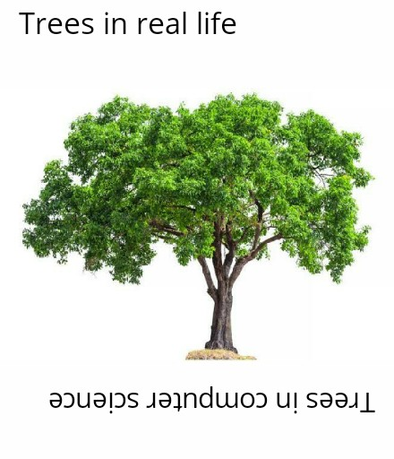
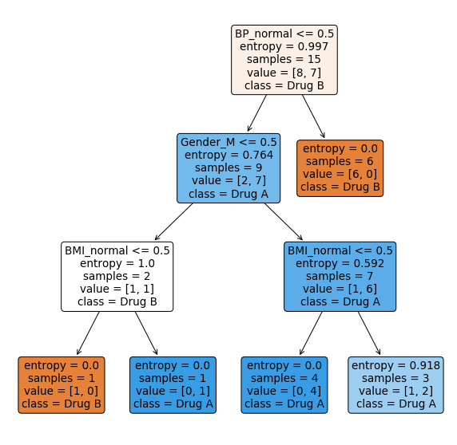

## Table of contents

- [What is CART?](#cart) 
- [Information Gain and Entropy](#entropy) 
- [Growing a Tree](#grow)
  - [Final Tree](#final-tree)
  - [Prediction](#prediction)
- [Using Software](#soft)
  - [R](#r)
  - [Python](#python)
- [Numerical Explanatory Variables](#numerical)
- [Other Splitting Metrics](#metrics)
  - [Gini Impurity](#gini)
  - [Variance Reduction](#variance)
- [Summary](#summary) 
- [References](#ref) 


```{r message=FALSE, warning=FALSE}
# r import
library(tidyverse)
library(knitr)
library(kableExtra)
library(Rgraphviz)
library(rpart)
library(rattle)
library(reticulate)

use_python("/home/ruslan/anaconda3/bin/python3.7")
```

```{python}
# python import
import pandas as pd
from sklearn import tree
import matplotlib.pyplot as plt
```

## <a name="cart">What is CART?</a>

**C**lassification **a**nd **R**egression **T**rees (or **CART** for short) is a type of supervised learning algorithm [[1]](#1)  that is mostly used in classification problems[[2]](#2), but can be applied for regression problems [[3]](#3) as well. It can handle both categorical and numerical input variables.

In this tutorial we are going to look at the **classification** problem.

Let's start with a simple example. Image that we have medical data about patients and we have two drugs (Drug A and Drug B) which work differently for each patient based on his health metrics. We have historical data about 15 patients and what drug have worked better for them. Now 16-th patient comes to us and we want to assign a drug to him based on this historical data. You can load the sample data set [here](DecisionTree_SampleData.csv).

```{r message=FALSE, warning=FALSE}
patients_df <- read_csv("DecisionTree_SampleData.csv")
kable(patients_df, format = "html", caption = "<b>Patients Data</b>") %>%
  kable_styling(bootstrap_options = "condensed")
```

Our decision tree is going to look something like this:

```{r echo=FALSE}
node0 <- "Root Node"
node1 <- "Decision Node #1"
node2 <- "Decision Node #2"
node3 <- "Decision Node #3"
node4 <- "Decision Node #4"
node5 <- "Leaf Node #1"
node6 <- "Leaf Node #2"
node7 <- "Leaf Node #3"
node8 <- "Leaf Node #4"
node9 <- "Leaf Node #5"
node10 <- "Leaf Node #6"
nodeNames <- c(node0, node1, node2, node3, node4,
               node5, node6, node7, node8, node9, node10)
        
# create new graph object
rEG <- new("graphNEL", nodes=nodeNames, edgemode="directed")
rEG <- addEdge(node0, node1, rEG)
rEG <- addEdge(node0, node2, rEG)
rEG <- addEdge(node1, node3, rEG)
rEG <- addEdge(node1, node4, rEG)
rEG <- addEdge(node3, node5, rEG)
rEG <- addEdge(node3, node6, rEG)
rEG <- addEdge(node4, node7, rEG)
rEG <- addEdge(node4, node8, rEG)
rEG <- addEdge(node2, node9, rEG)
rEG <- addEdge(node2, node10, rEG)

# specify the attributes of the object (color, shape, etc)
at <- list(node=list(fillcolor="lightblue", 
                     fontsize=14, shape="box", fixedsize=F), 
           edge=list(color="black"))

plot(rEG, attrs = at)
```

It doesn't look exactly like a "normal tree" we are used to see in a real life. The trick is that this tree is growing from top to down.

<center></img></center>

Image that all our data is located at the **root node** of the tree. Now we want to do is to **split** the data by most significant features (that will create new **decision nodes**) until we reach the **leaf nodes** with the **most homogeneous target** possible (meaning that ideally just one class is present in each leaf node). 

Now the question is how do we split the data at each node?

## <a name="entropy">Information Gain and Entropy</a>

The main metrics to use for dealing with classification problem are **Information gain** and **Gini impurity**. And **variance reduction** is most commonly used for dealing with regression tasks. We are going to use Information gain for this tutorial but at the end there will be formulas provided how to use other metrics since they have the same idea.

**Information gain** is based on the concept of **entropy** [[4]](#4) and information content from information theory [[5]](#5). First of all, let's build an intuition behind the entropy. Simply saying, entropy is the measure of chaos or uncertainty in the data.

Image that I asked you to play in a following simple game: I have two coins, one coin is unfair ($P(\text{Heads}) = \frac{4}{5}$), the other one is fair ($P(\text{Heads}) = \frac{1}{2}$). You can peak a coin and flip it. If it comes up Heads I will give you \$1. Which coin would you choose?

Well, I hope that you would choose unfair coin. In this case you are **more certain** about the outcome of the coin flip (on average it will come up Heads in $80\%$ of the time). For the fair coin you have the highest level of uncertainty, meaning that Heads and Tails can occur equally likely. Probability mass functions for both coins look as:

\begin{equation}
  p_{\text{unfair}} =
    \begin{cases}
      \frac{4}{5} & \text{Heads}\\
      \frac{1}{5} & \text{Tails}\\
    \end{cases}       
\end{equation}

\begin{equation}
  p_{\text{fair}} =
    \begin{cases}
      \frac{1}{2} & \text{Heads}\\
      \frac{1}{2} & \text{Tails}\\
    \end{cases}       
\end{equation}

We can calculate the entropy using the formula:

$$H(X) = - \sum_{i=1}^{n} p(x_i) \cdot log_2 [p(x_i)]$$

* $n$ is the number of all possible outcomes for random variable $X$
* $log_2$ is the logarithm with base 2 ($log_2 2 = 1$, $log_2 4 = 2$, etc)

Entropy for the unfair coin:

$$H(\text{unfair}) = - \left( \frac{4}{5} \cdot log_2 \frac{4}{5} + \frac{1}{5} \cdot log_2 \frac{1}{5} \right) \approx 0.72$$
Entropy for the fair coin:

$$H(\text{fair}) = - \left( \frac{1}{2} \cdot log_2 \frac{1}{2} + \frac{1}{2} \cdot log_2 \frac{1}{2} \right) = 1$$

```{r collapse=T}
entropy <- function(p) {
  return(-sum(p*log(p, base = 2)))
}

p_unfair <- c(4/5, 1/5)
p_fair <- c(1/2, 1/2)

entropy(p_unfair)
entropy(p_fair)
```

As you can see, entropy for the fair coin is **higher** meaning that the level of uncertainty is also **higher**. Note that entropy cannot be negative and the minimum value is $0$ which means the highest level of certainty. For example, image unfair coin with the probability $P(\text{Heads}) = 1$ and $P(\text{Tails}) = 0$. In such way you are sure that coin will come up Heads and entropy is equal to zero.

Coming back to our decision tree problem we want to split out data into nodes that have **reduced** the level of uncertainty (or in other words **increasing the information gain**). Basic algorithm look as following:

1. For each node:
  * Choose a feature from the data set.
* Calculate the significance (information gain) of that feature in splitting of data.
* Repeat for each feature.
2. Split the data by the feature that is the most significant splitter (highest information gain).
3. Repeat until there are no features left.

## <a name="grow">Growing a Tree</a>

As always for machine learning task we are going to split the data on training (first 15 patients) and test (16-th patient) sets. 

```{r}
train_df <- patients_df[-16, ]
test_df <- patients_df[16, ]
```

### Root Node

The initial entropy of the distribution of target variable (`Drug`) is:

$$H(X) = -\left( p(A) \cdot log_2 p(A) +  p(B) \cdot log_2 p(B) \right)$$

* $p(A)$ - probability of Drug A. Since there are 7 observations out of 15 with the Drug A $p(A) = \frac{7}{15} \approx 0.47$
* $p(B)$ - probability of Drug B. Since there are 8 observations out of 15 with the Drug A $p(B) = \frac{8}{15} \approx 0.53$

$$H(X) = -\left(0.47 \cdot log_2 0.47 +  0.53 \cdot log_2 0.53 \right) \approx 0.997$$

```{r}
temp_df <- train_df %>% 
  group_by(Drug) %>% 
  summarise(n = n(),
            p = round(n() / dim(train_df)[1], 2))

kable(temp_df, format = "html") %>%
  kable_styling(bootstrap_options = "striped")

entropy(temp_df$p)
```

For the next step we are going to split the data by **each** feature (`Gender`, `BMI`, `BP`), calculate the entropy and check which split variant gives the highest information gain.

#### Gender

Let's start with **Gender**. We have two labels in the data set: `M` and `F`. After splitting the data we end up with following proportions:

| Gender Label | Drug A | Drug B |
|:-:|:-:|:-:|
| M | 6 | 2 |
| F | 1 | 6 |

Meaning that among 15 patients 6 men were assigned to drug A and 2 were assigned to drug B whereas 1 woman was assigned to drug A and 6 women were assigned to drug B.

Calculate the entropy for each gender label:

| Gender Label | Drug A | Drug B | P(A) | P(B) | Entropy |
|:-:|:-:|:-:|:-:|:-:|:-:|
| M | 6 | 2 | $\frac{6}{8}$ | $\frac{2}{8}$ | 0.811 |
| F | 1 | 6 | $\frac{1}{6}$ | $\frac{5}{6}$ | 0.592 |

Now we would like to know how much information did we gain after the split.

$$\text{Information Gain} = \text{Entropy before the split} - \text{Weighted entropy after the split}$$

* Entropy before the split is the entropy at the root in this case
* Weighted entropy is defined as entropy times the label proportion. For example, weighted entropy for the Male patients is equals to:

$$\text{Weighted entropy (M)} = \frac{\text{# Male patients}}{\text{# All patients}} \cdot H(M)$$ 

$$\text{Weighted entropy (M)} = \frac{8}{15} \cdot 0.811 = 0.433$$

| Gender Label | Drug A | Drug B | P(A) | P(B) | Entropy | Weight | Weighted Entropy | 
|:-:|:-:|:-:|:-:|:-:|:-:|:-:|:-:|
| M | 6 | 2 | $\frac{6}{8}$ | $\frac{2}{8}$ | 0.811 | $\frac{8}{15}$ | 0.433 |
| F | 1 | 6 | $\frac{1}{6}$ | $\frac{5}{6}$ | 0.592 | $\frac{7}{15}$ | 0.276 |

Now we can calculate the information gain:

$$\text{Information Gain} = 0.997 - (0.433 + 0.276) = 0.288$$

#### BMI

Repeat the previous steps for the `BMI` feature. We have two labels: `normal` and `not normal`.

| BMI Label | Drug A | Drug B | P(A) | P(B) | Entropy | Weight | Weighted Entropy | 
|:-:|:-:|:-:|:-:|:-:|:-:|:-:|:-:|
| normal | 3 | 3 | $\frac{3}{6}$ | $\frac{3}{6}$ | 1 | $\frac{6}{15}$ | 0.4 |
| not normal | 4 | 5 | $\frac{4}{9}$ | $\frac{5}{9}$ | 0.991 | $\frac{9}{15}$ | 0.595 |

$$\text{Information Gain} = 0.997 - (0.4 + 0.595) = 0.002$$

#### Blood Pressure

And the same for `BP` column (labels are the same: `normal` and `not normal`):

| BP Label | Drug A | Drug B | P(A) | P(B) | Entropy | Weight | Weighted Entropy | 
|:-:|:-:|:-:|:-:|:-:|:-:|:-:|:-:|
| normal | 0 | 6 | $\frac{0}{6}$ | $\frac{6}{6}$ | 0 | $\frac{6}{15}$ | 0 |
| not normal | 7 | 2 | $\frac{7}{9}$ | $\frac{2}{9}$ | 0.764 | $\frac{9}{15}$ | 0.459 |

$$\text{Information Gain} = 0.997 - (0 + 0.459) = 0.538$$

#### Node Summary

As we can see `BP` gives the **highest** information gain, or in other words, if we split the data by this column we will be **more** certain about the target variable distribution. So our first split will look like this:

```{r}
node0 <- "Blood Pressure"
node1 <- "(normal node)"
node2 <- "(not normal node)"
nodeNames <- c(node0, node1, node2)
        
# create new graph object
rEG <- new("graphNEL", nodes=nodeNames, edgemode="directed")
rEG <- addEdge(node0, node1, rEG)
rEG <- addEdge(node0, node2, rEG)

# specify the attributes of the object (color, shape, etc)
at <- list(node=list(label = "foo", fillcolor="lightblue", 
                     fontsize=16, shape="box", fixedsize=F), 
           edge=list(color="black"))

plot(rEG, attrs = at)
```

### `BP:normal` Node

Continue to grow the tree from the `(normal node)`. We filter observations that have `normal` blood pressure:

```{r}
train_df %>% 
  filter(BP == "normal") %>% 
  select(-BP) %>% 
  kable(format = "html") %>%
  kable_styling(bootstrap_options = "striped")
```

As we can see, there is no Drug A for this node and entropy is already 0. This node is going to be last for this branch with the drug B as an output with probability = 1.

```{r}
node0 <- "Blood Pressure"
node1 <- "Drug B (P=1.)"
node2 <- "(not normal node)"
nodeNames <- c(node0, node1, node2)
        
# create new graph object
rEG <- new("graphNEL", nodes=nodeNames, edgemode="directed")
rEG <- addEdge(node0, node1, rEG)
rEG <- addEdge(node0, node2, rEG)

plot(rEG, attrs = at)
text(150, 200, "normal", col="black")
text(350, 200, "not normal", col="black")
```

### `BP:not normal` Node

Filter all the observations that have `not normal` blood pressure:

```{r}
train_df %>% 
  filter(BP == "not normal") %>% 
  select(-BP) %>% 
  kable(format = "html") %>%
  kable_styling(bootstrap_options = "striped")
```

Now we consider this set as "initial set". Entropy of target distribution at this node is $0.764$ (we have already calculated it). At this node we have two features: `Gender` and `BMI`. We perform the same procedure to find the best splitting feature.

#### Gender

| Gender Label | Drug A | Drug B | P(A) | P(B) | Entropy | Weight | Weighted Entropy | 
|:-:|:-:|:-:|:-:|:-:|:-:|:-:|:-:|
| M | 6 | 1 | $\frac{6}{7}$ | $\frac{1}{7}$ | 0.592 | $\frac{7}{9}$ | 0.46 |
| F | 1 | 1 | $\frac{1}{2}$ | $\frac{1}{2}$ | 1 | $\frac{2}{9}$ | 0.222 |

$$\text{Information Gain} = 0.764 - (0.46 + 0.222) = 0.082$$

#### BMI

| BMI Label | Drug A | Drug B | P(A) | P(B) | Entropy | Weight | Weighted Entropy | 
|:-:|:-:|:-:|:-:|:-:|:-:|:-:|:-:|
| normal | 4 | 1 | $\frac{4}{5}$ | $\frac{1}{5}$ | 0.722 | $\frac{5}{9}$ | 0.401 |
| not normal | 3 | 1 | $\frac{3}{4}$ | $\frac{1}{4}$ | 0.811 | $\frac{4}{9}$ | 0.361 |

$$\text{Information Gain} = 0.764 - (0.401 + 0.361) = 0.002$$

#### Node Summary 

Gender gives the most information gain after splitting the data. Now tree will look like this:

```{r}
node0 <- "Blood Pressure"
node1 <- "Drug B (P=1.)"
node2 <- "Gender"
node3 <- "(male node)"
node4 <- "(female node)"
nodeNames <- c(node0, node1, node2, node3, node4)
        
# create new graph object
rEG <- new("graphNEL", nodes=nodeNames, edgemode="directed")
rEG <- addEdge(node0, node1, rEG)
rEG <- addEdge(node0, node2, rEG)
rEG <- addEdge(node2, node3, rEG)
rEG <- addEdge(node2, node4, rEG)

plot(rEG, attrs = at)
text(100, 250, "normal", col="black")
text(300, 250, "not normal", col="black")
```

### `Gender:M` Node

Now we filer the set so that we have only observations with `BP:not normal` and `Gender:M`:

```{r}
train_df %>% 
  filter(BP == "not normal" & Gender == "M") %>% 
  select(-c(BP, Gender)) %>% 
  kable(format = "html") %>%
  kable_styling(bootstrap_options = "striped")
```

There is just one feature left `BMI`. Since we have no more features apart from this one we are going to "grow" last nodes with `BMI:normal` and `BMI:not normal` labels:

| BMI Label | Drug A | Drug B | P(A) | P(B) |
|:-:|:-:|:-:|:-:|:-:|
| normal | 2 | 1 | $\frac{2}{3}$ | $\frac{1}{3}$ |
| not normal | 4 | 0 | $\frac{4}{4}$ | $\frac{0}{4}$ |

For the `BMI:normal` node the predicted class is going to be Drug A, since its probability is higher. The same applies for `BMI:not normal` node. 

```{r}
node0 <- "Blood Pressure"
node1 <- "Drug B (P=1.)"
node2 <- "Gender"
node3 <- "BMI"
node4 <- "BMI "
node5 <- "Drug A (P=0.66)"
node6 <- "Drug A (P=1.)"
nodeNames <- c(node0, node1, node2, node3, node4, node5, node6)
        
# create new graph object
rEG <- new("graphNEL", nodes=nodeNames, edgemode="directed")
rEG <- addEdge(node0, node1, rEG)
rEG <- addEdge(node0, node2, rEG)
rEG <- addEdge(node2, node3, rEG)
rEG <- addEdge(node2, node4, rEG)
rEG <- addEdge(node3, node5, rEG)
rEG <- addEdge(node3, node6, rEG)

plot(rEG, attrs = at)
text(150, 300, "normal", col="black")
text(300, 300, "not normal", col="black")
text(270, 190, "male", col="black")
text(390, 190, "female", col="black")
text(150, 80, "normal", col="black")
text(360, 80, "not normal", col="black")
```

### `Gender:F` Node

Now we filer the set so that we have only observations with `BP:not normal` and `Gender:F`:

```{r}
train_df %>% 
  filter(BP == "not normal" & Gender == "F") %>% 
  select(-c(BP, Gender)) %>% 
  kable(format = "html") %>%
  kable_styling(bootstrap_options = "striped")
```

We are left with just 1 observation in each node. Predicted class for node `BMI:normal` is going to be Drug A ($P = 1.$). Predicted class for node `BMI:not normal` is going to be Drug B ($P = 1.$). 

### <a name="final-tree">Final Tree</a>

Using the information from the "female" branch we can visualize the final tree.

```{r}
node0 <- "Blood Pressure"
node1 <- "Drug B (P=1.)"
node2 <- "Gender"
node3 <- "BMI"
node4 <- "BMI "
node5 <- "Drug A (P=0.66)"
node6 <- "Drug A (P=1.)"
node7 <- "Drug A (P=1.) "
node8 <- "Drug B (P=1.) "
nodeNames <- c(node0, node1, node2, node3, 
               node4, node5, node6, node7, node8)
        
# create new graph object
rEG <- new("graphNEL", nodes=nodeNames, edgemode="directed")
rEG <- addEdge(node0, node1, rEG)
rEG <- addEdge(node0, node2, rEG)
rEG <- addEdge(node2, node3, rEG)
rEG <- addEdge(node2, node4, rEG)
rEG <- addEdge(node3, node5, rEG)
rEG <- addEdge(node3, node6, rEG)
rEG <- addEdge(node4, node7, rEG)
rEG <- addEdge(node4, node8, rEG)

plot(rEG, attrs = at)
text(150, 300, "normal", col="black")
text(260, 300, "not normal", col="black")
text(200, 190, "male", col="black")
text(310, 190, "female", col="black")
text(100, 80, "normal", col="black")
text(230, 80, "not normal", col="black")
text(290, 80, "normal", col="black")
text(420, 80, "not normal", col="black")
```

### <a name="prediction">Prediction</a>

Let's look at the 16-th patient:

```{r}
test_df %>% 
  kable(format = "html") %>%
  kable_styling(bootstrap_options = "striped")
```

To make a prediction we just need to move top to bottom by the branches of our tree. 

1. Check `BP`. Since `BP:not normal` go to left branch.
2. Check `Gender`. `Gender:M` => right branch.
3. Check `BMI`. `BMI:not normal` => right branch.

The predicted value is going to be `Drug A` with the probability of 1.0.

## <a name="soft">Using Software</a>

### <a name="r">R</a>

We can build a decision tree using `rpart` function (`rpart` package) and plot it with the help of `fancyRpartPlot` function (`rattle` package). Note, that R doesn't require to encode the categorical variables since it can handle them by itself.

```{r}
model_dt <- rpart(formula = Drug~Gender+BMI+BP,
                  data = train_df,
                  method = "class",
                  minsplit = 1,
                  minbucket = 1,
                  parms = list(split = "information")
)

#plot decision tree model
fancyRpartPlot(model_dt, caption = NULL, type=4)
```

Get a prediction for 16-th patient:

```{r collapse=T}
# return the class
predict(object = model_dt, newdata = test_df, type = "class")

# return the probability of each class
predict(object = model_dt, newdata = test_df, type = "prob")
```

Note that since R didn't split `Gender:M` node by `BMI` the probabilities are quite different that we expected but it doesn't effect the predicted class. 

### <a name="python">Python</a>

Unlike R, Python doesn't allow categorical input variables, so we need to encode them:

```{python results='hide'}
patients_df = pd.read_csv("DecisionTree_SampleData.csv")
# drop id column
patients_df.drop('Patient ID', axis=1, inplace=True)

# convert to dummy variables
patients_df_labeled = pd.get_dummies(patients_df)
columns_to_drop = ['Gender_F', 'BMI_not normal', 'BP_not normal', 'Drug_???', 'Drug_Drug B']
patients_df_labeled.drop(
    columns_to_drop, 
    axis=1, 
    inplace=True)
unknown_drug = patients_df_labeled.iloc[15, :]
patients_df_labeled.drop(15, axis=0, inplace=True) # unknow drug row
patients_df_labeled.head().to_html(classes='table table-striped')
```

<center><table border="0" class="dataframe table table-striped">\n  <thead>\n    <tr style="text-align: right;">\n      <th></th>\n      <th>Gender_M</th>\n      <th>BMI_normal</th>\n      <th>BP_normal</th>\n      <th>Drug_Drug A</th>\n    </tr>\n  </thead>\n  <tbody>\n    <tr>\n      <th>0</th>\n      <td>1</td>\n      <td>0</td>\n      <td>0</td>\n      <td>1</td>\n    </tr>\n    <tr>\n      <th>1</th>\n      <td>1</td>\n      <td>0</td>\n      <td>1</td>\n      <td>0</td>\n    </tr>\n    <tr>\n      <th>2</th>\n      <td>1</td>\n      <td>0</td>\n      <td>0</td>\n      <td>1</td>\n    </tr>\n    <tr>\n      <th>3</th>\n      <td>1</td>\n      <td>1</td>\n      <td>0</td>\n      <td>1</td>\n    </tr>\n    <tr>\n      <th>4</th>\n      <td>1</td>\n      <td>0</td>\n      <td>0</td>\n      <td>1</td>\n    </tr>\n  </tbody>\n</table></center>

For example `Gender_M:1` means that subject is Male and `Gender_M:0` means that subject is female.

To build a decision tree model we can use a `DecisionTreeClassifier` function from `sklearn.tree` module.

```{python}
# split the data 
X = patients_df_labeled.drop('Drug_Drug A', axis=1)
y = patients_df_labeled['Drug_Drug A']

# fit the decision tree model
model = tree.DecisionTreeClassifier(criterion='entropy')
model.fit(X, y)
```

```{python eval=FALSE}
plt.figure(figsize=(10,10))
tree.plot_tree(model, filled=True, rounded=True,
               feature_names=X.columns.tolist(), proportion=False,
               class_names=['Drug B', 'Drug A'])
plt.show()
```

<center></img></center>

Get a prediction for the 16-th patient:

```{python collapse=T}
unknown_drug = pd.DataFrame(unknown_drug).T
unknown_drug.drop(['Drug_Drug A'], axis=1, inplace=True)

# return the class
model.predict(unknown_drug)
```

```{python collapse=T}
# return the probability of each class
model.predict_proba(unknown_drug)
```

## <a name="numerical">Numerical Explanatory Variables</a>

In our simple data set we had only categorical variables (with 2 labels each). But what would model do if we had numerical value as an input? In fact, decision tree model (in R or Python) takes only numerical variables as an input.

I want to draw your attention to Python decision tree, especially on the decision nodes like `Gender_M <= 0.5`. Where does this `0.5` come from? The answer intersects with the answer how model handles numerical values.

Recall the `Gender_M` column we created for Python train set. It consisted of two **numerical** values (`0` and `1`). What model actually does is filtering the data by the **middle** value among these two numbers. "Middle" value was :$\frac{0+1}{2}=0.5$. Now model have to sets of data: one set has only those values that agree with condition `Gender_M <= 0 == True` (OR `Gender_M = 0` OR `Gender` is Female) and the other set that doesn't agree with condition `Gender_M <= 0 == False` (OR `Gender_M = 1` OR `Gender` is Male). R does this behind the scenes, so we don't need to worry about encoding, however Python tree was a good way to show how does the algorithm works. 

Image that we add a third category `Non-binary` to the `Gender` feature. First, we would encode the values and create a new column `Gender_encoded`, that would have three numerical values (`0`, `1` and `2`). Say, `Non-binary = 0`, `Male = 1`, `Female = 2`. Now model would have **three** conditions for filtering the data. 

* `Gender_encoded <= 0.5` (OR `Gender_encoded = 0` OR `Gender` is Non-binary)
* `Gender_encoded <= 1.5` (OR `Gender_encoded = 0 or 1` OR `Gender` is Non-binary | Male)

In a general form we can say that if we have numerical feature, algorithm will convert it to "categorical" by choosing the average "middle" value as a threshold between actual input values:

* filter 1: feature <= threshold
* filter 2: feature > threshold

For example:

| id | blood_pressure | drug |
|:-:|:-:|:-:|
| p01 | 100 | A |
| p02 | 120 | B |
| p03 | 150 | B |
| p03 | 200 | B |

"Middle threshold" values are: `110` ($\frac{100+120}{2}$), `135` ($\frac{120+150}{2}$), `175` ($\frac{150+200}{2}$).

## <a name="metrics">Other Splitting Metrics</a>

### <a name="gini">Gini Impurity</a>

As told before, for classification problem you can also use **Gini impurity** as a way to find the best splitting feature. The idea stays the same. The only difference is that instead of Entropy formula we are using Gini formula:

$$G(X) = 1 - \sum_{i=1}^{n} p(x_i)^2$$
After calculating Gini impurity value for each feature we would calculate the gain and chose the feature that has **the highest** gain.

$$\text{Gain} = \text{Gini impurity before the split} - \text{Weighted Gini impurity after the split}$$

### <a name="variance">Variance Reduction</a>

If we are dealing with regression problem (predicting numerical variable, rather than a class) we would use **variance reduction**. Instead of calculating the probabilities of target variable we calculate its variance:

$$Var(x) = \frac{\sum_{i=1}^n(x_i- \bar x)^2}{n-1}$$
And in the same way we are looking for a variable that has **the highest** variance reduction, or in other words variance in target variable becomes lower after the split.

$$\text{Variance Reduction} = \text{Variance before the split} - \text{Weighted variance after the split}$$

## <a name="summary">Summary</a>

I hope that it all made sense and it became a bit clearer how do CART models work. It is really simple algorithm that doesn't require much feature engineering and often used as a base estimator in more complex bagging and boosting models. Please let me know if you have any questions that I might have missed here.


## <a name="ref">References</a>

* <a name="1">[1]:</a> https://en.wikipedia.org/wiki/Supervised_learning
* <a name="2">[2]:</a> https://en.wikipedia.org/wiki/Statistical_classification
* <a name="3">[3]:</a> https://en.wikipedia.org/wiki/Regression_analysis
* <a name="4">[4]:</a> https://en.wikipedia.org/wiki/Entropy_(information_theory)
* <a name="5">[5]:</a> https://en.wikipedia.org/wiki/Information_theory

