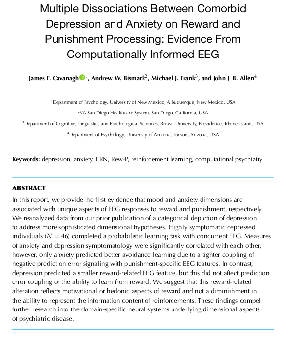
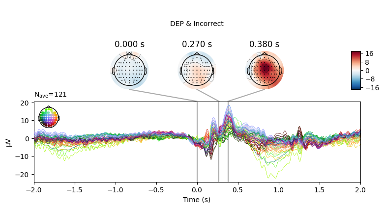

## Table of contents

- [Background](#background)
- [Overview of the Experiment](#overview-of-the-experiment)
- [Preprocessing](#preprocessing)
  - [Data Import](#data-import)
  - [Bad Channels/Trials](#bad-channelstrials) 
  - [Artifacts Removal](#artifacts-removal) 
- [Event-related potential](#event-related-potential)
  - [Epochs](#epochs)
  - [Resulted ERPs](#resulted-erps) 
- [Summary](#summary)  
- [References](#references)


## Background

Two years ago I have been working on EEG data (found at Kaggle[^1]) from an object recognition task experiment that was performed to investigate the genetic predisposition to alcoholism[^2]. My analysis was a pure mess since I didn't know a lot about EEG data processing/analysis. Time has passed, I still don't know much, but after finishing Mike X Cohen's course "Complete neural signal processing and analysis: Zero to hero" on Udemy[^3] (which I cannot recommend highly enough), I decided to get more practice with the help of publicly available data from Cavanagh et al (2019)[^4]. I used `MNE` Python package[^5] for this and tried to do it in a bit "tutorial" style for two reasons. First, it will be easier for me to remember after some time what the hell was I doing here. Second, I hope that other people who also start their journey in the EEG analysis can benefit from this.

**Disclaimer**

This analysis was made for educational purposes in order to get an idea of how to work with the EEG data. I was not going to make any inference/conclusions about subjects or conditions (even if I did, they should not be taken seriously).

## Overview of the Experiment

<center></center>

The original paper was published in Computational Psychiatry open source journal (the MIT Press)[^6] in 2018. One of the aims of the experiment was to investigate the association of EEG responses to reward and punishment among two groups, the control group (CTL) and the high depressive symptomatology group (DEP). Participants performed a probabilistic learning task, where a combination of two different images from the set was shown. Each image had its own probabilistic chance of being correct. The task was divided into training (participants were expected to learn the probability of being correct for each stimulus) and testing phases (experiment itself). 

Participants:

* CTL: N = 75 (50 females)
* DEP: N = 46 (34 females)
* An average age among all participants was 18 years.

## Preprocessing

### Data Import

For simplicity, I took just two data files, one subject from the DEP group (ID: 561), and one subject from the CTL group (ID: 507).


```python
import mne
import pickle 
import numpy as np
import pandas as pd
from scipy.io import loadmat

%matplotlib qt
```


```python
# loading raw matlab files
CTL = loadmat('depression_data/task/507.mat')
DEP = loadmat('depression_data/task/561.mat')

EEG = dict()
# data comes in a funny structure, so you have to dig deep with indexes 
# to extract it. `squeeze_me` argument doesn't look to help in such case
EEG['timevec'] = CTL['EEG']['times'][0][0][0]
EEG['srate'] = int(CTL['EEG']['srate']) # 1 sample/2 ms

# get the channel labels in a bit sophisticated way
EEG['chanlabels'] = list(np.hstack(CTL['EEG']['chanlocs'][0][0]['labels'][0]))
# mne package requires channel labels to be in a particular way, 
# so here I just change the cases for some channels
for i in range(len(EEG['chanlabels'])):
    EEG['chanlabels'][i] = EEG['chanlabels'][i].replace('Z', 'z')
    EEG['chanlabels'][i] = EEG['chanlabels'][i].replace('FP', 'Fp')

info = mne.create_info(
    ch_names=EEG['chanlabels'], 
    sfreq=EEG['srate'],
    ch_types='eeg')

# convert raw data into mne object
# also initial values were in microvolts, so convert them into volts
EEG['CTL_data'] = mne.io.RawArray(CTL['EEG']['data'][0][0]*10**(-6), info)
EEG['DEP_data'] = mne.io.RawArray(DEP['EEG']['data'][0][0]*10**(-6), info)
```

    Creating RawArray with float64 data, n_channels=66, n_times=356405
        Range : 0 ... 356404 =      0.000 ...   712.808 secs
    Ready.
    Creating RawArray with float64 data, n_channels=66, n_times=575973
        Range : 0 ... 575972 =      0.000 ...  1151.944 secs
    Ready.


Data was recorded at the 500 Hz rate. In other words, recordings were done every $\frac{1}{500} = 2 \cdot 10^{-3}$ seconds. Total duration of the recording for the CTL subject is 712.808 seconds, which is approximately 11-12 minutes. Total duration of the recording for the DEP subject is 1151.944 seconds, which is approximately 19 minutes.

Recordings were measured from 66 channels, including two electrooculography (EOG) electrodes placed near the eye (HEOG, VEOG), two electrodes on mastoid processes (M1, M2) and two cerebellar electrodes (CB1, CB2).


```python
biosemi_montage = mne.channels.make_standard_montage('biosemi64')
EEG['CTL_data'].set_montage(biosemi_montage, on_missing='ignore')
EEG['DEP_data'].set_montage(biosemi_montage, on_missing='ignore')
```


Some of the channels (M1, M2, PO5, PO6, CB1, CB2, HEOG, VEOG) were not recognized by the Biosemi 64 montage. It's "okay" since I would drop most of them anyway (leaving 60 electrodes). HEOG and VEOG channels were used to detect eye blinks and to compare with ICA components. M1 and M2 channels were used for reference. Cannot say much about PO5 and PO6 channels. In the original paper, they also reported that they used 60 channels plus two mastoids for the preprocessing stage.


```python
# referencing the data
# channel_i = channel_i - mean(channel_M1, channel_M2)
EEG['CTL_data'] = EEG['CTL_data'].set_eeg_reference(ref_channels=['M1', 'M2'])
EEG['DEP_data'] = EEG['DEP_data'].set_eeg_reference(ref_channels=['M1', 'M2'])
```

    EEG channel type selected for re-referencing
    Applying a custom EEG reference.
    EEG channel type selected for re-referencing
    Applying a custom EEG reference.


**EEG data of the CTL subject**:


```python
EEG['CTL_data'].plot(n_channels=len(EEG['CTL_data'].ch_names))
```


**EEG data of the DEP subject**:


```python
EEG['DEP_data'].plot(n_channels=len(EEG['DEP_data'].ch_names))
```


There was some funny business (voltage several orders higher than the rest of the signal) happening at the very of the recording, which I have removed.


```python
EEG['CTL_data'].crop(tmax=700)
EEG['DEP_data'].crop(tmax=1140);
```

### Bad Channels/Trials

All the channels for CTL subject looked fine to me. However, for the DEP subject F2 channel looked a bit suspicious (only high-frequency fluctuations), so I marked it as "bad".

The next step was to extract events data from the raw object and add it to the EEG data. There were lots of different event IDs, but I just used two specific ones: `94`, meaning correct trial, and `104`, meaning incorrect trial.

Then I annotated "bad" time spans. I paid attention to those that overlap with `94`/`104` events with the +/- 2 seconds interval since this time interval would be used for making epochs and all other epochs would be lost anyway. There were several time spans for both subjects that looked "bad" for me. An example can be seen below on the plot, with the suspiciously high-frequency signal.


```python
# extracting events info from the raw file
for data in [CTL, DEP]:
    event_df = pd.DataFrame(data['EEG']['event'][0][0][0])
    # fun with indexes again
    event_df['type'] = event_df['type'].apply(lambda x: x[0])
    for col in ['latency', 'urevent']:
        event_df[col] = event_df[col].apply(lambda x: x[0][0]) 
    
    # convert strings to integers
    event_df['type'] = event_df['type'].apply(lambda x: 900 if x == 'keyboard0' else (
        1 if x == 'keypad1' else (
            2 if x == 'keypad2' else (
                999 if x == 'boundary' else int(x)))))
    
    # mne requires events data to be in numpy array with three columns:
    # time of occurence; second column for whatever reason which is ignored anyway; event id
    events = np.array(event_df[['latency', 'type']])
    events = np.insert(events, 1, values=0, axis=1)
    
    if data == CTL:
        EEG['CTL_events'] = events
    else:
        EEG['DEP_events'] = events
        
# just a fancy way to add colors and labels to the plot
event_color = dict(zip(event_df['type'].unique(), ['b']*len(event_df['type'].unique())))
event_color[94] = 'g'
event_color[104] = 'r'

event_id = {'COR': 94, 'INCOR': 104}

del event_df, events, CTL, DEP
```


```python
EEG['CTL_data'].plot(events=EEG['CTL_events'], start=182, event_id=event_id, event_color=event_color)
```


```python
EEG['DEP_data'].plot(events=EEG['DEP_events'], start=844, event_id=event_id, event_color=event_color)
```


```python
# marked bad channel
EEG['DEP_data'].info['bads']
```


    ['F2']


### Artifacts Removal

The next step was to remove eye blinks from the data. HEOG and VEOG electrodes were put around an eye to measure the horizontal and vertical eye movements respectively and they could be used for references. I applied an Individual Component Analysis (ICA)[^7] to separate the signal sources.


```python
# drop the redundant channels
EEG['CTL_data'].drop_channels(ch_names=['HEOG', 'VEOG', 'CB1', 'CB2', 'M1', 'M2', 'PO5', 'PO6'])
EEG['DEP_data'].drop_channels(ch_names=['HEOG', 'VEOG', 'CB1', 'CB2', 'M1', 'M2', 'PO5', 'PO6'] + EEG['DEP_data'].info['bads'])
```


#### CTL Group


```python
# mne tutorial suggests to filter the data from low frequencies (keep 1Hz+)
# since they can affect ICA result
filt_raw = EEG['CTL_data'].copy()
filt_raw.load_data().filter(l_freq=1., h_freq=None)
```

    Filtering raw data in 1 contiguous segment
    Setting up high-pass filter at 1 Hz
    
    FIR filter parameters
    ---------------------
    Designing a one-pass, zero-phase, non-causal highpass filter:
    - Windowed time-domain design (firwin) method
    - Hamming window with 0.0194 passband ripple and 53 dB stopband attenuation
    - Lower passband edge: 1.00
    - Lower transition bandwidth: 1.00 Hz (-6 dB cutoff frequency: 0.50 Hz)
    - Filter length: 1651 samples (3.302 sec)
    

```python
ica = mne.preprocessing.ICA()
ica.fit(filt_raw)
```

    Fitting ICA to data using 58 channels (please be patient, this may take a while)
    Inferring max_pca_components from picks
    Omitting 8222 of 350001 (2.35%) samples, retaining 341779 (97.65%) samples.
    Selecting all PCA components: 58 components
    Fitting ICA took 80.6s.


```python
ica.plot_sources(EEG['CTL_data'])
```


```python
ica.plot_components(picks=range(15))
```


```python
# make a plot of signal without the first component
ica.plot_overlay(EEG['CTL_data'], exclude=[0], picks='eeg')
```

    Transforming to ICA space (58 components)
    Zeroing out 1 ICA component


THe first (ICA000) component was clearly an eye blink. The signal was stable for the whole time with some occasional drops caused by events at the front of the head. 

Some other components, like ICA002 or ICA014, also looked weird for me, but that's something for me to work on.


```python
ica.exclude = [0] # exclude just first (ICA000) component
ica.apply(EEG['CTL_data'])

del ica, filt_raw
```

    Transforming to ICA space (58 components)
    Zeroing out 1 ICA component


#### DEP Group


```python
filt_raw = EEG['DEP_data'].copy()
filt_raw.load_data().filter(l_freq=1., h_freq=None)
```

    Filtering raw data in 1 contiguous segment
    Setting up high-pass filter at 1 Hz
    
    FIR filter parameters
    ---------------------
    Designing a one-pass, zero-phase, non-causal highpass filter:
    - Windowed time-domain design (firwin) method
    - Hamming window with 0.0194 passband ripple and 53 dB stopband attenuation
    - Lower passband edge: 1.00
    - Lower transition bandwidth: 1.00 Hz (-6 dB cutoff frequency: 0.50 Hz)
    - Filter length: 1651 samples (3.302 sec)
    

```python
ica = mne.preprocessing.ICA()
ica.fit(filt_raw)
```

    Fitting ICA to data using 57 channels (please be patient, this may take a while)
    Inferring max_pca_components from picks
    Omitting 5585 of 570001 (0.98%) samples, retaining 564416 (99.02%) samples.
    Selecting all PCA components: 57 components
    Fitting ICA took 141.5s.


```python
ica.plot_sources(EEG['DEP_data'])
```


```python
ica.plot_components(picks=range(15))
```


```python
ica.plot_overlay(EEG['DEP_data'], exclude=[0], picks='eeg')
```

    Transforming to ICA space (57 components)
    Zeroing out 1 ICA component


```python
ica.exclude = [0] 
ica.apply(EEG['DEP_data'])

del ica, filt_raw
```

    Transforming to ICA space (57 components)
    Zeroing out 1 ICA component


DEP subject got even more "suspicious" components, which I ignored for now.


```python
# at this stage I used to save the EEG locally to avoid repeating the same steps
# every time I rerun the notebook

# with open('EEG.pickle', 'wb') as f:
#     pickle.dump(EEG, f)

# with open('EEG.pickle', 'rb') as f:
#     EEG = pickle.load(f)
```

## Event-related potential

The final step (for this part) was to get the Event-Related Potential (ERP)[^8] for both conditions: correct and incorrect, meaning that there were 4 ERPs: DEP&COR, DEP&INCOR, CTL&COR, CTL&INCOR. 

### Epochs

First signal had to be split into epochs according to the events (94/104) times. Time window is +/- 2 seconds around the feedback onset. Then signal was baseline corrected to the average signal from -0.2 to 0 seconds prefeedback. Bandpass filter (0.5-20 Hz) was applied. 


```python
for g in ['DEP', 'CTL']:
    for o in ['correct', 'incorrect']:
        if o == 'correct':
            eid = 94
        else:
            eid = 104
        
        # copy of the signal to apply the bandpass filter on
        filt_raw = EEG[f'{g}_data'].copy()
        filt_raw.load_data().filter(l_freq=0.5, h_freq=20, verbose=False)
        
        EEG[f'{g}_epochs_{o}'] = mne.Epochs(
            raw=filt_raw, 
            events=EEG[f'{g}_events'], 
            event_id=eid, 
            tmin=-2, 
            tmax=2, 
            baseline=(-0.2, 0))
        
        # drop bad time spans
        EEG[f'{g}_epochs_{o}'].drop_bad()
        # get ERP
        EEG[f'{g}_erp_{o}'] = EEG[f'{g}_epochs_{o}'].average()
        EEG[f'{g}_erp_{o}'].comment = f"{g}&{o}"
```


Total trials for each case:

* CTL & correct: 72 total events, 7 bad events, final 55 events.
* CTL & incorrect: 48 total events, 3 bad events, final 45 events.
* DEP & correct: 169 total events, 5 bad events, final 164 events.
* DEP & incorrect: 125 total events, 4 bad events, final 121 events.

### Resulted ERPs


```python
EEG['CTL_erp_correct'].plot_joint(times=[0, 0.24, 0.34], title='CTL & Correct')
```


```python
EEG['CTL_erp_incorrect'].plot_joint(times=[0, 0.27, 0.38], title='CTL & Incorrect')
```


```python
EEG['DEP_erp_correct'].plot_joint(times=[0, 0.23, 0.34], title='DEP & Correct')
```


```python
EEG['DEP_erp_incorrect'].plot_joint(times=[0, 0.27, 0.38], title='DEP & Incorrect')
```





In most of the cases, picks in poststimulus response were caused by the increased activity around the Fz-FCz-Cz areas. Below is the comparing ERP signal at the FCz channel for CTL and DEP group for each outcome. 


```python
mne.viz.plot_compare_evokeds(
    [EEG['CTL_erp_correct'].copy().pick_channels(['FCz']), 
     EEG['DEP_erp_correct'].copy().pick_channels(['FCz'])], 
    title='Correct at ch. FCz')
```


```python
mne.viz.plot_compare_evokeds(
    [EEG['CTL_erp_incorrect'].copy().pick_channels(['FCz']), 
     EEG['DEP_erp_incorrect'].copy().pick_channels(['FCz'])], 
    title='Incorrect at ch. FCz')
```


The plots looked somewhat similar to the plot in the original paper (Figure 3). Prominent N2-P3 peaks for incorrect trials and two peaks at approximately the same level for correct trials.

## Summary

This was it for now. I learned how to perform first preprocessing steps on EEG data (referencing, eye blinks removal, baseline correction, epochs splitting). Some parts like detecting bad channels/trials and separating noise from the signal using ICA need more experience and practice from me.

In the next part I am going to perform a time-frequency analysis for both subjects.

## References

[^1]: https://archive.ics.uci.edu/ml/datasets/eeg+database
[^2]: https://github.com/ruslan-kl/EEG-data-analysis
[^3]: https://www.udemy.com/course/solved-challenges-ants/
[^4]: Cavanagh, J. F., Bismark, A. W., Frank, M. J., & Allen, J. J. B. (2019). Multiple Dissociations Between Comorbid Depression and Anxiety on Reward and Punishment Processing: Evidence From Computationally Informed EEG. *Computational Psychiatry*, 3, 1–17. DOI: http://doi.org/10.1162/CPSY_a_00024
[^5]: https://mne.tools/stable/index.html
[^6]: http://computationalpsychiatry.org/
[^7]: https://www.sciencedirect.com/topics/neuroscience/independent-component-analysis
[^8]: https://www.sciencedirect.com/topics/neuroscience/event-related-potential
