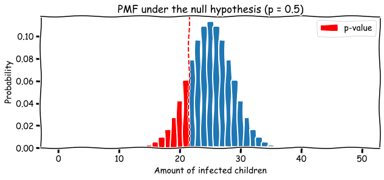
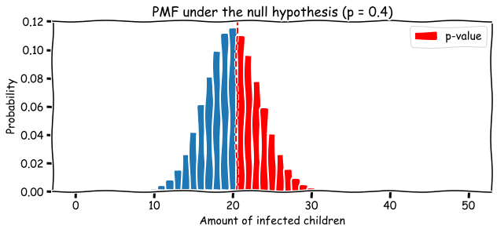
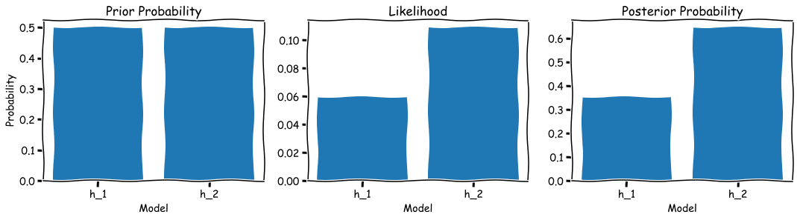
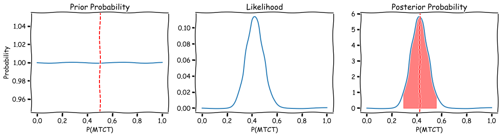
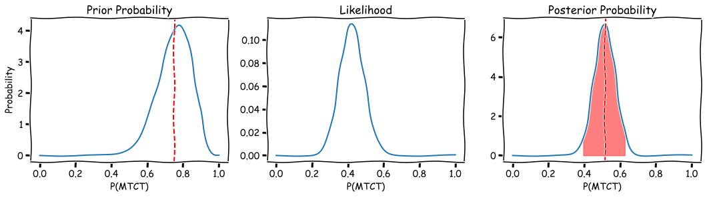
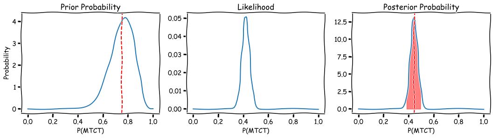

## Table of contents

- [Introduction](#introduction)
- [Frequentist Approach](#frequentist-approach)
  - [Changing Hypotheses](#changing-hypotheses)
  - [Confidence Intervals](#confidence-intervals)
- [Bayesian Approach](#bayesian-approach) 
  - [Beta-Binomial Distribution and Credible Intervals](#beta-binomial-distribution-and-credible-intervals) 
- [Summary](#summary)
- [Additional Resources](#additional-resources)
- [References](#references) 


## Introduction

<details><summary>Code</summary>
<p>

```python
import numpy as np
import matplotlib.pyplot as plt
from scipy import stats
from statsmodels.stats.proportion import proportion_confint   

RANDOM_SEED = 1
plt.xkcd();
```


```python
def binom_beta(a, b, n, k):
    """
    Parameters:
        a: alpha
        b: beta
        n: number of trials
        k: number of succeses
    """
    
    x = np.linspace(0,1,100)
    # prior values
    mean_prior = a/(a+b)
    prior = stats.beta.pdf(x=x, a=a, b=b)

    likelihood = stats.binom.pmf(k=k, n=n, p=x)

    # posterior values
    a_new = a + k
    b_new = b + n - k
    mean_post = a_new / (a_new+b_new)
    post = stats.beta.pdf(x=x, a=a_new, b=b_new)

    # 95% credible interval
    lwr = stats.beta.ppf(q=0.025, a=a_new, b=b_new)
    uppr = stats.beta.ppf(q=0.975, a=a_new, b=b_new)

    # indeces for plotting the credible interval
    indx1 = np.isclose(lwr, x, atol=1e-02).argmax()
    indx2 = np.isclose(uppr, x, atol=1e-02).argmax() + 1

    print(f"Number of trials: {n}")
    print(f"Number of successes: {k}")
    print(f"Prior mean: {mean_prior:.2}")
    print(f"Posterior mean: {mean_post:.2}")
    print(f"95% credible interval: ({lwr:.2}, {uppr:.2})")

    plt.figure(figsize=(18, 4))

    plt.subplot(131)
    plt.plot(x, prior)
    plt.axvline(mean_prior, linestyle='--', color='r')
    plt.xlabel('P(MTCT)')
    plt.ylabel('Probability')
    plt.title('Prior Probability')

    plt.subplot(132)
    plt.plot(x, likelihood)
    plt.xlabel('P(MTCT)')
    plt.title('Likelihood')

    plt.subplot(133)
    plt.plot(x, post)
    plt.fill_between(x=x[indx1:indx2], y1=post[indx1:indx2],
                     alpha=0.5, color='red')
    plt.axvline(mean_post, linestyle='--', color='r')
    plt.xlabel('P(MTCT)')
    plt.title('Posterior Probability')

    plt.show()
```

</p>
</details>
<br>

Frequentist vs Bayesian battle is one of the "hot" topics in the statistics world. On the one hand, Bayesian says that p-value can be uninformative and can find statistically significant differences when in fact there are none. On the other hand, Frequentist says that choosing prior probabilities for your hypotheses might be cheating. In this overview I will try to show a simple example of the hypothesis testing for a population proportion using both approaches. However, I will not make any statements like "X approach is awesome, do not use Y approach" and leave the conclusion making to the reader. Most of the calculations will be done "by hand" along with Python implementations, but I will try to keep a balance between going too much into details and skipping some parts.

Alright, let's begin! 

Consider the mother-to-child transmission (MTCT) of HIV (human immunodeficiency virus) ratio[^1]. You want to check whether the probability that an HIV-positive mother can transmit HIV to her baby during pregnancy, childbirth, or breastfeeding is 0.5 or less (say, 0.4). You have collected data from 50 HIV-positive women and their new-born children. 21 children were tested positive for HIV (0.42 ratio). Is there enough evidence to say that the probability of MTCT is less than a random chance given the observed data? (*Disclaimer: numbers are made up*).

## Frequentist Approach 

Let’s start with the Frequentist approach and null hypothesis significance testing (NHST). Under this framework we usually (if not always) set our null hypothesis ($H_0$) value to some constant value, build the desired probability distribution assuming that $H_0$ is true and then find the probability of observed data in the direction of the alternative hypothesis ($H_A$). Direction could be one-sided (less/greater, $<$ / $>$, one-tail test) or two-sided (less or greater, $\neq$, two-tail test). For our example we have:

* $H_0$: the probability of MTCT of HIV is 50%, $P(\text{MTCT})=0.5$;
* $H_A$: the probability of MTCT of HIV is less than 50%, $P(\text{MTCT})<0.5$;
* Significance level $\alpha=5\%$

In other words, we build a distribution under the assumption that the probability of MTCT is 0.5 and we want to check if the data we collected provides enough evidence that it comes from the distribution with another probability (which is less than 0.5). The significance level is our threshold value, which is kind of arbitrary, but in most cases is set to 5%. We will reject the null hypothesis if the **p-value**[^2] is less than $\alpha$.

{}
In statistical testing, the **p-value** is the probability of obtaining test results at least as extreme as the results actually observed, under the assumption that the null hypothesis is correct. A very small p-value means that such an extreme observed outcome would be very unlikely under the null hypothesis.
{}

$n=50$, $k=21$

Since our data follows a Binomial distribution we can calculate the probability mass function given the null value.


```python
n = 50
k = 21
h_0 = 1/2
x = np.arange(n+1)
probs = stats.binom.pmf(k=x, n=n, p=h_0)
# temporary array for the plot (p-value)
temp = probs.copy()
temp[x>k] = 0
```

<details><summary>Code</summary>
<p>

```python
plt.figure(figsize=(10,4))
plt.bar(x, probs)
plt.bar(x, temp, color='r', label='p-value')
plt.axvline(k+0.5, linestyle='--', color='r')
plt.title(f'PMF under the null hypothesis (p = {h_0})')
plt.ylabel('Probability')
plt.xlabel('Amount of infected children')
plt.legend()
plt.show()
```
</p>
</details>




We want to know the probability of obtaining the results as extreme as the results actually observed. Since we had a one-tail test ($<$), the "extreme" results would be obtaining 21 or less HIV infected children (red bars).

$$\scriptsize \text{p-value} = \sum_{i=0}^k P(X_i) = P(0) + P(1) + ... + P(21)$$
$$\tiny =\binom{50}{0} \left( \frac{1}{2} \right) ^0 \left( 1 - \frac{1}{2} \right) ^{50-0} + \binom{50}{1}\left( \frac{1}{2} \right) ^1 \left( 1 - \frac{1}{2} \right) ^{50-1}$$
$$\tiny + ... + \binom{50}{21} \left( \frac{1}{2} \right) ^{21} \left( 1 - \frac{1}{2} \right) ^{50-21}$$
$$\scriptsize \approx 0.161$$


```python
p_val = stats.binom.cdf(k=k, n=n, p=h_0)
# equivalent
# p_val = stats.binom_test(x=k, n=n, p=h_0, alternative='less') 
print(f"p-value = {p_val: .3f}")
```

    p-value =  0.161


p-value equals 0.161 so we **failed to reject the null hypothesis**, meaning that there is not enough evidence to claim that the probability of MTCT of HIV is less than a random chance (0.5). 

### Changing Hypotheses

Here is an interesting phenomenon. We have seen that there is not enough evidence to reject the hypothesis that 21 out of 50 infected children come from a distribution with the probability of success 0.5. What will happen if we change the hypothesis but keep the idea somewhat similar. Is there enough evidence to claim that the population proportion is greater than 0.4?

* $H_0$: the probability of MTCT of HIV is 40%, $P(\text{MTCT})=0.4$;
* $H_A$: the probability of MTCT of HIV is greater than 40%, $P(\text{MTCT})>0.4$;
* $\alpha=5\%$


```python
h_0 = 4/10
probs = stats.binom.pmf(k=x, n=n, p=h_0)
temp = probs.copy()
temp[x<k] = 0
```

<details><summary>Code</summary>
<p>

```python
plt.figure(figsize=(10,4))
plt.bar(x, probs)
plt.bar(x, temp, color='r', label='p-value')
plt.axvline(k-0.5, linestyle='--', color='r')
plt.title(f'PMF under the null hypothesis (p = {h_0})')
plt.ylabel('Probability')
plt.xlabel('Amount of infected children')
plt.legend()
plt.show()
```
</p>
</details>




$$\scriptsize \text{p-value} = \sum_{i=21}^n P(X_i) = P(21) + P(22) + ... + P(50)$$
$$\tiny =\binom{50}{21} \left( \frac{4}{10} \right) ^{21} \left( 1 - \frac{4}{10} \right) ^{50-21} + \binom{50}{2} \left( \frac{4}{10} \right) ^{22} \left( 1 - \frac{4}{10} \right) ^{50-22}$$
$$\tiny + ... + \binom{50}{50} \left( \frac{4}{10} \right) ^{50} \left( 1 - \frac{4}{10} \right) ^{50-50}$$
$$\scriptsize \approx 0.439$$

```python
p_val = 1 - stats.binom.cdf(k=k-1, n=n, p=h_0)
# equivalent
# p_val = stats.binom_test(x=k, n=n, p=h_0, alternative='greater') 
print(f"p-value = {p_val: .3f}")
```

    p-value =  0.439

Now we calculate the binomial pmf function with the probability of success $P(\text{MTCT})=0.4$ and p-value is going to be a sum of probabilities $P(X \geq 21)$. We can see that this value is around 44%, which is much higher than our significance level alpha. Again, we **failed to reject the null hypothesis**, meaning that there is not enough evidence to claim that the probability of MTCT of HIV is higher than 40%. 

We were unable to reject the hypothesis that MTCT ratio is 50%, but at the same time, we were unable to reject the hypothesis that the ratio is 40%. As we can see, NHST is very sensitive to the null hypothesis you choose. Changing the hypotheses (even if the idea behind them stays quite the same) can lead to contradictory results.

### Confidence Intervals

We could also build a Frequentist confidence interval to show our uncertainty about the ratio of MTCT. For the large amount of $n$ in binomial trials, we can say that random variable $X$ follows a normal distribution with the mean $\hat{p}$ and standard error $\frac{\hat{p}(1-\hat{p})}{n}$.

$$X \sim \mathcal{N} \big( \mu = \hat{p}, SE = \frac{\hat{p}(1-\hat{p})}{n} \big)$$

Once we have a normal distribution we can easily calculate 95% CI:

$$(1-\alpha) \text{% CI}: \mu \pm Z_{1-\alpha/2} \cdot SE$$

* $\hat{p} = \frac{k}{n}=0.42$
* $Z_{1-0.05/2} = 1.96$
* $SE = \frac{0.42(1-0.42)}{50} \approx 0.07$

$$95\text{% CI}: (0.28, 0.56)$$

```python
p_hat = k/n
z_score = stats.norm.ppf(0.975) 
se = np.sqrt((k/n * (1-k/n))/n)

lwr, uppr = p_hat - z_score*se, p_hat + z_score*se

# equivalent
# proportion_confint(count=k, nobs=n, alpha=0.05, method='normal')

print(f"95% CI for the proportion: ({lwr:.2f}, {uppr:.2f}).")
```

    95% CI for the proportion: (0.28, 0.56).


In other words, we are 95% confident that the true proportion of MTCT lies in the interval $(0.28, 0.56)$. However, we don't know if our CI has included the true value (it is either 0 or 1). We can also say, that if we would get more samples of the size 50 and calculated the CI for each of them, 95% of these CIs would hold a true value.

### Bayesian Approach

Now it’s Bayesian approach turn. Under this framework, we can specify two distinct hypotheses and check which one is more likely to be true.

* $H_1$: the probability of MTCT of HIV is 50%, $P(\text{MTCT})=0.5$;
* $H_2$: the probability of MTCT of HIV is 40%, $P(\text{MTCT})=0.4$.

We are going to apply Bayes rule to calculate the posterior probability after we observed the data.

$$\scriptsize P(\text{Model}|\text{Data}) = \frac{P(\text{Data|Model}) \cdot P(\text{Model})}{P(\text{Data})}$$

* $P(\text{Data|Model})$ is the **likelihood**, or probability that the observed data would happen given that model (hypothesis) is true. 
* $P(\text{Model})$ is the **prior probability** of a model (hypothesis).
* $P(\text{Data})$ is the probability of a given data. It is also sometimes referred to as **normalizing constant** to assure that the posterior probability function sums up to one.
* $P(\text{Model}|\text{Data})$ is the **posterior probability** of the hypothesis given the observed data.

Assume that we have no prior information about the MTCT, so we believe that both hypotheses have equal chances to be true. 

**Prior**: 

$\scriptsize P(H_1)=P(H_2)=\frac{1}{2}$

*Note that the prior probability mass function has to sum up to 1*.

**Likelihood**:

* $\tiny P(k = 21 | H_1 \text{ is true}) = \binom{n}{k} \cdot P(H_1)^k \cdot (1-P(H_1))^{n-k}$

    $\scriptsize = \binom{50}{21} \cdot 0.5^{21} \cdot (1-0.5)^{50-21}=0.0598$

* $\tiny P(k = 21 | H_2 \text{ is true}) = \binom{n}{k} \cdot P(H_2)^k \cdot \left( 1-P(H_2) \right) ^{n-k}$

    $\scriptsize = \binom{50}{21} \cdot 0.4^{21} \cdot (1-0.4)^{50-21}=0.109$

**Posterior probabilities**:

* $\scriptsize P(H_1 \text{ is true|}k = 21) = \frac{P(k = 21 | H_1 \text{ is true}) \cdot P(H_1)}{P(\text{k = 21})}$

* $\scriptsize P(H_2 \text{ is true|}k = 21) = \frac{P(k = 21 | H_2 \text{ is true}) \cdot P(H_2)}{P(\text{k = 21})}$

$$\tiny P(k=21)=P(k = 21 | H_1 \text{ is true}) \cdot P(H_1) + P(k = 21 | H_2 \text{ is true}) \cdot P(H_2)$$

$$\scriptsize =0.0598 \cdot 0.5 + 0.109 \cdot 0.5 = 0.084$$

* $\scriptsize P(H_1 \text{ is true|}k = 21) = 0.354$
* $\tiny P(H_2 \text{ is true|}k = 21) = 1 - P(H_1 \text{ is true|}k = 21) = 0.646$

As we can see, the probability of the second hypothesis $P(MTCT) = 40\%$ equals 64.6%, whereas the probability of the first hypothesis $P(MTCT) = 50\%$ equals 35.4%.

If we want to check if there is enough evidence against one of the hypotheses, we can use the **Bayes factor**[^3] (which is kind of an analog of the Frequentist's p-value).

{}
The **Bayes factor** is a likelihood ratio of the marginal likelihood of two competing hypotheses, usually a null and an alternative. The aim of the Bayes factor is to quantify the support for a model over another, regardless of whether these models are correct.
{}

$$\scriptsize \text{BF}(H_2:H_1)= \frac{\text{Likelihood}_2}{\text{Likelihood}_1}$$
$$\scriptsize = \frac{P(k = 21 | H_2 \text{ is true})}{P(k = 21 | H_1 \text{ is true})} =  \frac{\frac{P(H_2 \text{ is true}|k=21) P(k=21)}{P(H_2\text{ is true)}}}{\frac{P(H_1 \text{ is true}|k=21) P(k=21)}{P(H_1\text{ is true)}}}$$
$$\scriptsize = \frac{\frac{P(H_2 \text{ is true}|k=21)}{P(H_1\text{ is true}|k=21)}}{\frac{P(H_2)}{P(H_1)}} = \frac{\text{Posterior Odds}}{\text{Prior Odds}}$$

$$\scriptsize \text{BF}(H_2:H_1)= \frac{\frac{0.646}{0.354}}{\frac{0.5}{0.5}} \approx 1.82$$

To interpret the value we can refer to Harold Jeffreys interpretation table:

<center></img></center>

Hence we can see there is **not enough supporting evidence for $H_2$** (that the MTCT rate is 40%).


```python
prior = {'h_1': .5, 'h_2': .5}
model = {'h_1': .5, 'h_2': .4}
likelihood = {'h_1': stats.binom.pmf(k=k, n=n, p=model['h_1']),
              'h_2': stats.binom.pmf(k=k, n=n, p=model['h_2'])}
norm_const = (likelihood['h_1']*prior['h_1'] + likelihood['h_2']*prior['h_2'])
posterior = {'h_1': likelihood['h_1']*prior['h_1'] / norm_const,
             'h_2': likelihood['h_2']*prior['h_2'] / norm_const}

bf = (posterior['h_2']/posterior['h_1']) / (prior['h_2']/prior['h_1'])
print(f"Bayes Factor (H2:H1) = {bf:.2f}")
```

    Bayes Factor (H2:H1) = 1.82

<details><summary>Code</summary>
<p>

```python
plt.figure(figsize=(18, 4))

plt.subplot(131)
plt.bar(x=prior.keys(), height=prior.values())
plt.xlabel('Model')
plt.ylabel('Probability')
plt.title('Prior Probability')

plt.subplot(132)
plt.bar(x=likelihood.keys(), height=likelihood.values())
plt.xlabel('Model')
plt.title('Likelihood')

plt.subplot(133)
plt.bar(x=posterior.keys(), height=posterior.values())
plt.xlabel('Model')
plt.title('Posterior Probability')

plt.show()
```

</p>
</details>




### Beta-Binomial Distribution and Credible Intervals

We have specified two distinct hypotheses $H_1$ and $H_2$. But also we could define the whole posterior probability distribution function of an unknown parameter $P(\text{MTCT})$. 

Let's assume that we have no prior information about the probability of HIV transmission and $P(\text{MTCT})$ can take any value on the $[0,1]$ range. Or in other words $P(\text{MTCT})$ follows a uniform distribution $P(\text{MTCT}) \sim \text{unif}(0,1)$. For the reasons, that will not be discussed here, we are going to replace the Uniform distribution with Beta distribution $\text{Beta}(\alpha,\beta)$ with parameters $\alpha=1$, $\beta=1$, $P(\text{MTCT}) \sim \text{Beta}(1,1)$, which is exactly like the uniform. It just makes calculations (and life) easier since Beta and Binomial distribution form a **conjugate family**[^4]. The likelihood still follows a Binomial distribution.

Now, in order to find the posterior distribution we can just update the values of the Beta distribution:

* $\alpha^* = \alpha + k$ 
* $\beta^* = \beta + n - k$ 

<i>Note: I skipped the calculations that explain how $\alpha^\*$ and $\beta^\*$ were obtained, but you can find them here.[^5]</i>

The expected value of the Beta distribution is:

$$E(x) = \frac{\alpha}{\alpha+\beta}$$

To summarize:

* **Prior**: $\scriptsize P(\text{MTCT}) \sim \text{Beta}(\alpha=1,\beta=1)$
* **Likelihood**: $\scriptsize P \big( k = 21 | P(\text{MTCT}) \big) \sim B(n, P(\text{MTCT}))$

    $ \scriptsize= \binom{n}{k} \cdot P(\text{MTCT})^k \cdot \big( 1-P(\text{MTCT}) \big) ^{n-k}$

* **Posterior**: $\scriptsize P(\text{MTCT}) \sim \text{Beta}(\alpha^\*=\alpha + k,\beta^\* = \beta + n - k)$

After we find the posterior distribution we can derive the Bayesian **credible interval** (CrI) which will tell us the probability of our unknown parameter $P$. Usually it is found as the narrowest interval with the desired area (like 0.95).


```python
# custom function
binom_beta(a=1, b=1, n=n, k=k)
```

```
Number of trials: 50
Number of successes: 21
Prior mean: 0.5
Posterior mean: 0.42
95% credible interval: (0.29, 0.56)
```





What can we tell from these three plots? First, we knew nothing about our parameter $P(\text{MTCT})$, it could be any value from 0 to 1 with the expected value of 0.5 (prior). After we got 21 out of 50 HIV-positive children we could calculate the probability of obtaining such results under each value of $P(\text{MTCT})$ in the $[0,1]$ range (likelihood). And finally, we were able to update our probability distribution function to get the posterior probabilities. We see, that given the data, the expected value for the $P(\text{MTCT})$ is 0.42. The real value of $P(\text{MTCT})$ is in the range $(0.29, 0.56)$ with the probability of 95% (CrI).

The question that could be asked here is what would happen if we chose wrong priors, would we get different results? This might be the case. However, with the relatively large amount of trials, posterior distribution relies more on a likelihood, rather than prior probability distribution so priors don't have a big weight on the results. 

Let's say that we believe that the probability of mother-to-child transmission is definitely bigger than the random chance (0.5) with the expected value 0.75. We can use parameters $\alpha=15$, $\beta=5$ for this.


```python
binom_beta(a=15, b=5, n=n, k=k)
```

```
Number of trials: 50
Number of successes: 21
Prior mean: 0.75
Posterior mean: 0.51
95% credible interval: (0.4, 0.63)
```





As we can see, posterior distribution has not shifted that much, meaning the priors didn't have so much weight. 

Now imagine that we have 5 times more observations (with the same ratio 0.42):


```python
binom_beta(a=15, b=5, n=n*5, k=k*5)
```

```
Number of trials: 250
Number of successes: 105
Prior mean: 0.75
Posterior mean: 0.44
95% credible interval: (0.39, 0.5)
```





The shape of the posterior distribution looks more like the shape of likelihood and now the credible interval became narrower, meaning that we have decreased uncertainty about the unknown parameter $P(\text{MTCT})$.

## Summary

As I told at the beginning, the purpose of this overview was not to distinguish "the best" approach, but rather look at their differences and pros/cons. The key points of each approach are represented in a table:

| Frequentist Approach | Bayesian Approach |
|:--|:--|
| Doesn't rely on prior information about the unknown | Relies on prior information about the unknown (but prior beliefs become less significant as the sample size increases) |
| Sensitive to the null hypothesis | Is not sensitive to hypotheses |
| Estimates the degree of uncertainty using confidence intervals | Estimates the degree of uncertainty using credible intervals |
| Cannot distinguish the probability of a true value in a CI (it is either 0 or 1) | Can distinguish the probability of a true value in a CrI |

## Additional Resources

If you would like to learn more about Frequentist and Bayesian approaches here are some resources I personally like:

1. Online book: **An Introduction to Bayesian Thinking. A Companion to the Statistics with R Course**, Merlise Clyde, Mine Cetinkaya-Rundel, Colin Rundel, David Banks, Christine Chai, Lizzy Huang, 2020: [link](https://statswithr.github.io/book/)
2. Online book:  **An Introduction to Bayesian Data Analysis for Cognitive Science**, Bruno Nicenboim, Daniel Schad, and Shravan Vasishth, 2020: [link](https://vasishth.github.io/bayescogsci/book/)
3. Coursera specialization: **Statistics with R Specialization** by Duke University: [link](https://www.coursera.org/specializations/statistics)
4. Coursera course: **Bayesian Statistics: From Concept to Data Analysis** by University of California, Santa Cruz:  [link](https://www.coursera.org/learn/bayesian-statistics/)
5. YouTube videos: **Bayesian statistics: a comprehensive course**: [link](https://www.youtube.com/playlist?list=PLFDbGp5YzjqXQ4oE4w9GVWdiokWB9gEpm)
6. Keysers, C., Gazzola, V. & Wagenmakers, EJ. Using Bayes factor hypothesis testing in neuroscience to establish evidence of absence. *Nat Neurosci* 23, 788–799 (2020). `https://doi.org/10.1038/s41593-020-0660-4`

## References

[^1]: [WHO | Mother-to-child transmission of HIV](https://www.who.int/hiv/topics/mtct/about/en/)
[^2]: [p-value - Wikipedia](https://en.wikipedia.org/wiki/P-value)
[^3]: [Bayes factor - Wikipedia](https://en.wikipedia.org/wiki/Bayes_factor)
[^4]: [Conjugate prior - Wikipedia](https://en.wikipedia.org/wiki/Conjugate_prior)
[^5]: [Beta-binomial distribution - Wikipedia](https://en.wikipedia.org/wiki/Beta-binomial_distribution)
[^6]: [An Introduction to Bayesian Thinking](https://statswithr.github.io/book/)