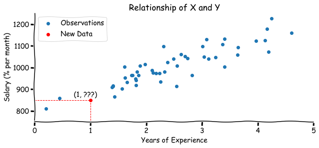
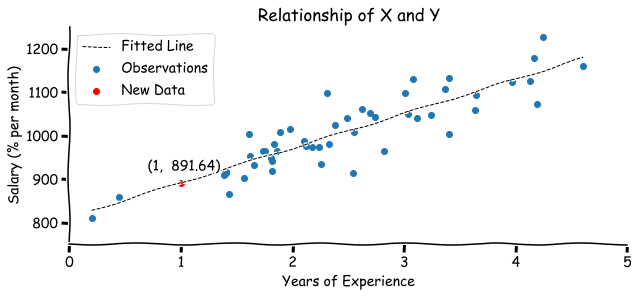
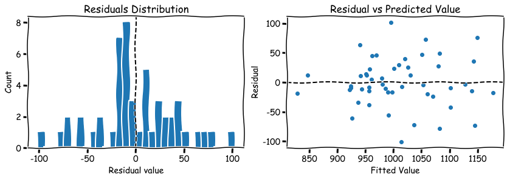
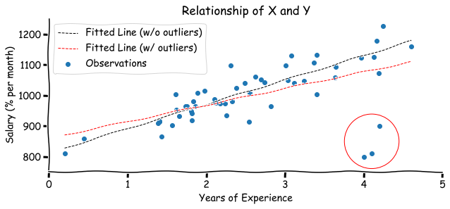

```python
import matplotlib.pyplot as plt
import numpy as np
from sklearn.datasets import make_regression
from sklearn.linear_model import LinearRegression

plt.xkcd()
RANDOM_SEED = 1
```

## Table of contents

- [Intro](#intro)
- [General Form](#general-form)
- [Ordinary Least Squares](#ordinary-least-squares)
- [Properties of OLS](#properties-of-ols)
- [Multicollinearity](#multicollinearity)
- [Making a Prediction](#making-a-prediction)
- [Assumptions for Linear Regression](#assumptions-for-linear-regression)
- [Goodness of Fit](#goodness-of-fit)
- [Summary](#summary)


## Intro

As you probably know, the main task of Machine Learning algorithms is to make predictions based on past data. The basic scenario sounds like this:

> Imagine you have two variables: X (let it be *years of experience* of an ML engineer) and Y (*salary* of ML specialist). You want to build a model to predict the salary of an engineer based on his years of experience as the new data comes in.

This is called a **regression** task (we are predicting **continuous** variable). Most of the time the good model to start with is a Linear Regression since it's considered to be a simple and intuitive model. But despite its simplicity, linear regression can be the worst model for prediction if it was modeled incorrectly. In this tutorial, we are going to look at the math behind the **Ordinary Least Squares (OLS)** method, its assumptions and properties, and when things can go wrong. 


```python
# generate two random variables of size 50
n = 50
years, salary = make_regression(n_samples=n, 
                                n_features=1, 
                                noise=50, 
                                random_state=RANDOM_SEED)
years = years.reshape(n,) + 2.5
salary = salary + 1000
```

We have simulated two samples with years of experience and a salary of size 50. What would be the salary for someone with 1 year of experience? Looking at this graph or from your prior knowledge you might assume that there is a **linear** relationship between years of experience and the salary. And according to the data the most relevant guess would be in a $[800,950]$ range.


<details><summary>Code</summary>
<p>

```python
plt.figure(figsize=(10,4))
plt.scatter(years, salary, label='Observations')
plt.scatter([1], [850], color='red', label='New Data')
plt.text(x=0.7, y=865, s="(1, ???)")
plt.vlines(x=1, ymin=0, ymax=850, linestyle='--', 
           linewidth=1, color='red')
plt.hlines(y=850, xmin=-1, xmax=1, linestyle='--', 
           linewidth=1, color='red')

plt.xlim([0,5])
plt.ylim([750, 1250])
plt.xlabel('Years of Experience')
plt.ylabel('Salary (% per month)')
plt.title('Relationship of X and Y')
plt.gca().spines['top'].set_visible(False)
plt.gca().spines['right'].set_visible(False)
plt.legend()
plt.show()
```

</p>
</details>





According to the idea of a Linear Regression, we want to fit a line that represents the relationship between the salary and experience. You might remember that the line equation can be written as $y = kx + b$. For our problem:

$$y = \beta_0 + \beta_1 x \tag{1}$$

* $y$ - salary
* $x$ - years of experience
* $\beta_0$ - intercept (value of intersection with $y$ axis) 
* $\beta_1$ - slope (the rate of change)

The equation $(1)$ can be also referred as a **population regression line**. In other words, we assume that salary of **all** engineers can be perfectly predicted by this equation.

You can check how different values of intercept and slope affect the line in this [interactive demo](https://phet.colorado.edu/sims/html/graphing-slope-intercept/latest/graphing-slope-intercept_en.html)


## General Form

But as we can see, even though the relationship seems to be positive (salary increases as experience go up), the relationship is not exactly linear and there is some noise (error $\epsilon$) in our sample. Let's consider a more general case when we have $k$ independent variables of $n$ observations in a matrix form. In such case:

* $y$ - is a vector of dependent (predicted) variable of size $(n \times 1)$
* $x$ - is a matrix of independent variables of size $(n \times k)$
* $\beta$ - is a vector of parameters of size $(k \times 1)$
* $\epsilon$ - is a vector of errors of size $(n \times 1)$


Or more simply:

$$y = X \beta + \epsilon \tag{3}$$

*Note, that the intercept is added into $\beta$ vector that's why we have a row of ones in $X$ matrix.*

The goal is to find the estimated values of coefficients $b$ of population parameters $\beta$.

## Ordinary Least Squares

We can achieve that with the help of the **Ordinary Least Squares** method. This method fits a line through the data points that minimizes the sum of the squared differences between observed values and corresponding fitted values.

$$\hat{y} = X b \tag{4}$$

$$\epsilon = y - \hat{y} = y - Xb \tag{5}$$

* $\hat{y}$ - predicted values

The sum of squared residuals (**RSS**):

<a href="https://www.codecogs.com/eqnedit.php?latex=\begin{bmatrix}&space;\epsilon_1&space;&&space;\epsilon_2&space;&&space;...&space;&&space;\epsilon_n&space;\end{bmatrix}&space;\begin{bmatrix}&space;\epsilon_1&space;\\&space;\epsilon_2&space;\\&space;...&space;\\&space;\epsilon_n&space;\end{bmatrix}&space;=&space;[\epsilon_1&space;\epsilon_1&space;&plus;&space;\epsilon_2&space;\epsilon_2&space;&plus;&space;...&space;&plus;&space;\epsilon_n&space;\epsilon_n]" target="_blank"></a>

Since RSS is just a scalar we know that:

$$\epsilon^T = \epsilon = y - Xb = (y - Xb)^T \tag{7}$$

Then we can use this equation to find the RSS formula:

$$\epsilon^T \epsilon = (y - Xb)^T (y - Xb) $$
$$ = (y^T - X^T b^T)(y - Xb)$$
$$ = y^T y - y^T Xb - X^T b^T y + X^T b^T X b $$
$$ = y^T y - 2X^T b^T y + X^T b^T X b \tag{8}$$

To find the $b$ that minimizes the sum of squared residuals, we need to take the derivative of $\epsilon^T \epsilon$ with respect to $b$. 

$$\frac{\partial \epsilon^T \epsilon}{\partial b} = -2 X^T y + 2 X^T X b = 0 \tag{9}$$

And this gives us:

$$ X^T X b = X^T y \tag{10}$$

To find $b$ we can multiply each side of the equation by $(X^T X)^{-1}$:

$$ (X^T X)^{-1} (X^T X) b = (X^T X)^{-1} X^T y \tag{11}$$

Since by definition $(X^T X)^{-1} (X^T X) = I$, where $I$ is an identity matrix with ones on a main diagonal and zeros elsewhere.

$$ I b = (X^T X)^{-1} X^T y$$

$$ b = (X^T X)^{-1} X^T y \tag{12}$$

Let's check a simple case:


<a href="https://www.codecogs.com/eqnedit.php?latex=X&space;=&space;\begin{bmatrix}&space;1&space;&&space;1&space;\\&space;1&space;&&space;2&space;\end{bmatrix},&space;y&space;=&space;\begin{bmatrix}&space;3&space;\\&space;5&space;\end{bmatrix}" target="_blank"></a>

As we can see the regression line should be defined as $y = 1 + 2x$

Calculations:

1. <a href="https://www.codecogs.com/eqnedit.php?latex=X^T&space;X&space;=&space;\begin{bmatrix}&space;1&space;&&space;1&space;\\&space;1&space;&&space;2&space;\end{bmatrix}&space;\begin{bmatrix}&space;1&space;&&space;1&space;\\&space;1&space;&&space;2&space;\end{bmatrix}&space;=&space;\begin{bmatrix}&space;2&space;&&space;3&space;\\&space;3&space;&&space;5&space;\end{bmatrix}" target="_blank"></a>

2. <a href="https://www.codecogs.com/eqnedit.php?latex=(X^T&space;X)^{-1}&space;=&space;\frac{1}{2&space;\times&space;5&space;-&space;3&space;\times&space;3}&space;\begin{bmatrix}&space;5&space;&&space;3&space;\\&space;-3&space;&&space;2&space;\end{bmatrix}&space;=&space;\begin{bmatrix}&space;5&space;&&space;3&space;\\&space;-3&space;&&space;2&space;\end{bmatrix}" target="_blank"></a>

3. <a href="https://www.codecogs.com/eqnedit.php?latex=X^T&space;y&space;=&space;\begin{bmatrix}&space;1&space;&&space;1&space;\\&space;1&space;&&space;2&space;\end{bmatrix}&space;\begin{bmatrix}&space;3&space;\\&space;5&space;\end{bmatrix}&space;=&space;\begin{bmatrix}&space;8&space;\\&space;13&space;\end{bmatrix}" target="_blank"></a>

4. <a href="https://www.codecogs.com/eqnedit.php?latex=(X^T&space;X)^{-1}&space;X^T&space;y&space;=&space;\begin{bmatrix}&space;5&space;&&space;-3&space;\\&space;-3&space;&&space;2&space;\end{bmatrix}&space;\begin{bmatrix}&space;8&space;\\&space;13&space;\end{bmatrix}&space;=&space;\begin{bmatrix}&space;1&space;\\&space;2&space;\end{bmatrix}" target="_blank"></a>

Exactly what we have expected!


```python
# numpy calculations
x = np.array([[1, 1], [1, 2]])
y = np.array([[3], [5]])
b = np.linalg.inv(x.T@x) @ (x.T@y)
print(b)
```

```python
# [[1.]
#  [2.]]
```


## Properties of OLS

If we rewrite the equation $(10)$ using $y = Xb + \epsilon$ we get:

$$ X^T X b = X^T (Xb + \epsilon) = X^T Xb + X^T \epsilon$$

$$ X^T \epsilon = 0 \tag{13}$$

Now let's take a look at the first element in $X^T \epsilon$ vector. We can see that it equals to zero:

$$1 \times \epsilon_1 + 1 \times \epsilon_2 + ... 1 \times \epsilon_n = 0 \tag{14}$$

Which means that **the sum of residuals $\sum_{i=1}^n \epsilon_i$ equals to 0**. The same applies to the mean $\bar{\epsilon} = 0$.

If we divide regression equation $(3)$ by the number of observations $n$ we get:

$$\frac{y}{n} = \frac{X}{n}b + \frac{\epsilon}{n}$$

$$\bar{y} = \bar{x}b \tag{15}$$

This means that **the least squares line always goes through $(\bar{x}, \bar{y})$ point**.

## Multicollinearity

Looks pretty simple so far, right? But let's take a look when things can go wrong.

Recall the equation $(12)$. There might be cases when the inverse matrix $(X^T X)^{-1}$ doesn't exist: 

* if the rank\* of a matrix $X^T X$ is less then $n$, meaning that one or more of the independent variables are a linear combination of the other variables (**multicollinearity**).
* if $n<k$ (the number of variables is larger than the number of observations).
* if the determinant of $X^T X$ is zero.

\* The rank of a matrix is defined as the maximum number of linearly independent column vectors in the matrix or the maximum number of linearly independent row vectors in the matrix.


```python
# example 1
x = np.array(
    [[1, 2, 4],
     [1, 3, 6],
     [1, 2, 5]])

print(f"Matrix rank: {np.linalg.matrix_rank(x.T@x)}")
try:
    print(f"Inverse matrix:\n{np.linalg.inv(x.T@x)}")
except np.linalg.LinAlgError as e:
    print(f"Inverse matrix doesn't exist. {e}")
```

```python
# Matrix rank: 3
# Inverse matrix:
# [[13.  1. -3.]
#  [ 1.  6. -3.]
#  [-3. -3.  2.]]
```


```python
# example 2
x = np.array(
    [[1, 2, 4],
     [1, 3, 6],
     [1, 2.5, 5]])

print(f"Matrix rank: {np.linalg.matrix_rank(x.T@x)}")
try:
    np.linalg.inv(x.T@x)
except np.linalg.LinAlgError as e:
    print(f"Inverse matrix doesn't exist. {e} was given")
```

```python
# Matrix rank: 2
# Inverse matrix doesn't exist. Singular matrix was given
```

```python
# example 3
x = np.array(
    [[1, 2, 4],
     [1, 3, 6]])

print(f"Matrix rank: {np.linalg.matrix_rank(x.T@x)}")
try:
    print(f"Inverse matrix:\n{np.linalg.inv(x.T@x)}")
except np.linalg.LinAlgError as e:
    print(f"Inverse matrix doesn't exist. {e}")
```

```python
# Matrix rank: 2
# Inverse matrix doesn't exist. Singular matrix
```

```python
# example 4
x = np.array(
    [[2, 4],
     [3, 6],
     [2, 5]])

print(f"Matrix rank: {np.linalg.matrix_rank(x.T@x)}")
try:
    print(f"Inverse matrix:\n{np.linalg.inv(x.T@x)}")
except np.linalg.LinAlgError as e:
    print(f"Inverse matrix doesn't exist. {e}")
```

```python
# Matrix rank: 2
# Inverse matrix:
# [[ 5.92307692 -2.76923077]
#  [-2.76923077  1.30769231]]
```

In the case of multicollinearity there is not going to be a single solution for $(X^T X)^{-1}$, but rather an infinite number of them.

## Making a Prediction

Now we can apply the OLS method on our experience-salary example and find out the expected salary for the engineer with 1 year of experience. 


```python
X = np.vstack([np.ones(shape=n), years]).T # add column with ones
b = np.linalg.inv(X.T@X) @ (X.T@salary)
y_hat = X@b
print(f"Model: y ={b[0]: .2f} +{b[1]: .2f}x")
```

```python
# Model: y = 812.11 + 79.52x
```


```python
x_space = np.linspace(years.min(), years.max(), 1000) # for a smooth line
y_space = b[0] + b[1]*x_space

# value to predict
x_new = 1
y_new = b[0] + b[1]*x_new
```


<details><summary>Code</summary>
<p>

```python
plt.figure(figsize=(10,4))
plt.scatter(years, salary, label='Observations')
plt.plot(x_space, y_space, '--', color='black', linewidth=1, label='Fitted Line')
plt.scatter([x_new], [y_new], color='red', label='New Data')
plt.text(x=0.7, y=920, s=f"(1, {y_new: .2f})")

plt.xlim([0,5])
plt.ylim([750, 1250])
plt.xlabel('Years of Experience')
plt.ylabel('Salary (% per month)')
plt.title('Relationship of X and Y')
plt.gca().spines['top'].set_visible(False)
plt.gca().spines['right'].set_visible(False)
plt.legend()
plt.show()
```

</p>
</details>





Based on a fitted model, engineer with 1 year of experience is expected to earn 891.64$ per month. 

### `sklearn` realization

And obviously you don't have to do this calculations by hand since there is already a `sklearn` realization:


```python
# sklearn realization
ols_model = LinearRegression(fit_intercept=True)
ols_model.fit(years.reshape(n,1), salary)
print(f"Model: y ={ols_model.intercept_: .2f} +{ols_model.coef_[0]: .2f}x")
```

```python
# Model: y = 812.11 + 79.52x
```


```python
# prediction
print(ols_model.predict(np.array(x_new).reshape(1,1)))
```

```python
# [891.63525261]
```

## Assumptions for Linear Regression 

1. A **linear** relationship between $y$ and $X$.
2. The dependent variables $X$ should be **linearly independent** (no perfect multicollinearity).
3. Approximate **normality of residuals distribution** centered at 0, $\epsilon \sim N(0, \sigma)$, $E[\epsilon] = 0$.
4. **Constant variability** (heteroscedasticity).

Some possible ways for assumptions check:

1. The linear relationship between 2 variables can be easily inspected on a scatter plot.
2. Highly correlated variables can be found in the correlation matrix $R_{xx}$.
3. THe simplest way is to plot a histogram of residuals after model was fitted. 
4. Scatter plot the residuals against the predicted values. There should be no "fan" shape or some other fun shapes.


<details><summary>Code</summary>
<p>

```python
errors = salary - y_hat

plt.figure(figsize=(14,4))
plt.subplot(121)
plt.hist(errors, bins=30)
plt.axvline(0, linestyle='--', color='black')
plt.xlabel('Residual value')
plt.ylabel('Count')
plt.title('Residuals Distribution')

plt.subplot(122)
plt.scatter(y_hat, errors)
plt.axhline(0, linestyle='--', color='black')
plt.xlabel('Fitted Value')
plt.ylabel('Residual')
plt.title('Residual vs Predicted Value')
plt.show()
```
</p>
</details>





Another important piece of information to keep in mind is that the fitted line can be affected by **outliers**. Assume that you got the information about three new engineers. Even though they have worked for 4 years already, their salary is still low. See what happens to the regression line when we include these observations into a model:


```python
# add 3 new points
years_outlier = np.concatenate([years, [4, 4.1, 4.2]])
salary_outlier = np.concatenate([salary, [800, 810, 900]])

X = np.vstack([np.ones(shape=n+3), years_outlier]).T # add column with ones
b = np.linalg.inv(X.T@X) @ (X.T@salary_outlier)
y_hat = X@b
print(f"Model: y ={b[0]: .2f} +{b[1]: .2f}x")
```

```python
# Model: y = 859.96 + 54.23x
```


<details><summary>Code</summary>
<p>

```python
y_space_outlier = b[0] + b[1]*x_space

plt.figure(figsize=(10,4))
plt.scatter(years_outlier, salary_outlier, label='Observations')
plt.plot(x_space, y_space, '--', color='black', linewidth=1, label='Fitted Line (w/o outliers)')
plt.plot(x_space, y_space_outlier, '--', color='red', linewidth=1, label='Fitted Line (w/ outliers)')
plt.scatter(4.1, 850, s=6000, facecolors='none', edgecolors='r')
plt.xlim([0,5])
plt.ylim([750, 1250])
plt.xlabel('Years of Experience')
plt.ylabel('Salary (% per month)')
plt.title('Relationship of X and Y')
plt.gca().spines['top'].set_visible(False)
plt.gca().spines['right'].set_visible(False)
plt.legend()
plt.show()
```
</p>
</details>





There are two possible types of outliers:

1. **Leverage point** - observation that is located away from the point cloud, but *doesn't affect* the slope of the regression line.
2. **Influential point** - observation that *affects* the slope of the regression line.

## Goodness of Fit

After you have fitted the model you might want to check how good your model is. One of the most common metrics is **R square** (coefficient of determination), which shows the percentage of dependent variable variation explained by the model. It can be found as:

$$R^2 = r_{xy}^T R_{xx}^{-1} r_{xy} \tag{16}$$

* $r_{xy}$ - vector of correlations between independent variables and dependent variable $[r_{x_1y} r_{x_2y} ... r_{x_ky}]^T$
* $R_{xx}$ - correlation matrix between predictor variables

<a href="https://www.codecogs.com/eqnedit.php?latex=R&space;=&space;\begin{bmatrix}&space;r_{x_1&space;x_1}&space;&&space;r_{x_1&space;x_2}&space;&&space;...&space;&&space;r_{x_1&space;x_k}&space;\\&space;r_{x_2&space;x_1}&space;&&space;r_{x_2&space;x_2}&space;&&space;...&space;&&space;r_{x_2&space;x_k}&space;\\&space;...&space;&&space;...&space;&&space;...&space;&&space;...&space;\\&space;r_{x_k&space;x_1}&space;&&space;r_{x_k&space;x_2}&space;&&space;...&space;&&space;r_{x_k&space;x_k}&space;\\&space;\end{bmatrix}" target="_blank"></a>

If there is only one independent variable $x$, then $R^2$ equals to squared correlation value between $x$ and $y$.

However, there are some limitations of $R^2$ - it always increases whenever a new variable is added to the model. So even if you add some irrelevant feature to $X$ (for example height of the person for salary prediction) $R^2$ will stay the same or can even increase a bit.


```python
r_xy = np.corrcoef(years, salary)[0, 1] # correlation
R_sq = r_xy**2

print(f"{R_sq*100: .2f}% of salary variance change can be explained by the model.")
```

```python
# 78.19% of salary variance change can be explained by the model.
```

```python
# sklearn
print(f"R-squared: {ols_model.score(years.reshape(n,1), salary): .4f}")
```

```python
# R-squared:  0.7819
```

Example with 5 predictors:


```python
k = 5
x, y = make_regression(n_samples=n, 
                       n_features=k, 
                       noise=50, 
                       random_state=RANDOM_SEED)
x = np.concatenate([np.ones(shape=(n,1)), x], axis=1)
```


```python
r_xy = np.corrcoef(x[:,1:], y, rowvar=False)[-1, :-1]
R_xx = np.corrcoef(x[:, 1:], rowvar=False)
R_sq = r_xy.T@np.linalg.inv(R_xx)@r_xy

print(f"{R_sq*100: .2f}% of salary variance change can be explained by the model.")
```

```python
# 73.76% of salary variance change can be explained by the model.
```


```python
# sklearn realization
ols_model = LinearRegression(fit_intercept=False)
ols_model.fit(x, y)
print(f"R-squared: {ols_model.score(x, y): .4f}")
```

```python
# R-squared:  0.7376
```

## Summary

To sum it up we can generalize steps for OLS regression model fitting steps:

* Before the fitting:
  1. Check the relationship between dependent and independent variables. It should be linear.
  2. Check the relationship between each independent variables combinations. No variable should be a linear combination of another.
  2. Check for outliers.
* After the fitting:
  1. Check the distribution of residuals (errors). It should be normal with the center at zero.
  2. Check for the constant variance (no weird patterns on a residual-fitted value plot).
  3. Check your $R^2$.
