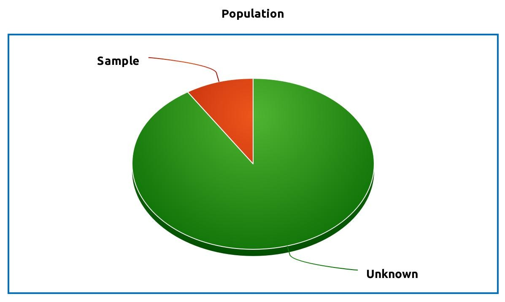

<p style="font-size:15px"><i> Cover image credit: <b><a href="https://pixabay.com/ru/users/geralt-9301/?utm_source=link-attribution&amp;utm_medium=referral&amp;utm_campaign=image&amp;utm_content=2692575">Gerd Altmann</a></b> from <b><a href="https://pixabay.com/ru/?utm_source=link-attribution&amp;utm_medium=referral&amp;utm_campaign=image&amp;utm_content=2692575">Pixabay</a></b></i></p>

## Table of contents

- [Introduction](#introduction)
- [Intuitive Example](#intuitive-example)
  - [One-tailed vs Two-tailed Test](#one-tailed-vs-two-tailed-test)
- [Inference for a mean](#inference-for-a-mean)
- [Data Set](#data-set)
- [One Sample Test](#one-sample-test)
- [Two Sample Test (Independent Groups)](#two-sample-test-independent-groups)
- [Two Sample Test (Paired Groups)](#two-sample-test-paired-groups)
- [Comparing More than Two Means (ANOVA)](#comparing-more-than-two-means-anova)
- [Summary](#summary)
- [References](#references)


```{r message=FALSE, warning=FALSE}
# r import
library(tidyverse)
library(knitr)
library(reticulate)
library(broom)

options(digits = 4)
use_python("/home/ruslan/anaconda3/bin/python3.7")
```

```{python}
# python import
import pandas as pd
from scipy import stats
```

```{r}
# custom functions
nhst_result <- function(pval, alpha){
  if(pval < alpha) {
    print(paste0("p-value is less than alpha (", 
                 alpha, "). Reject null hypothesis."))
  } else {print(paste0("p-value is greater than alpha (", 
                     alpha, "). Fail to reject null hypothesis."))}
}
```


## Introduction

The concept of hypothesis testing is analogous to concept of criminal trials. Consider that you are a judge during a trial and there is a person for a criminal offense. You must decide if the defendant is innocent or guilty. Your basic knowledge is that the person is innocent and after evidence comes in you need to make a choice - is there enough evidence to claim that the defendant is guilty? 

<center>
<figure>
 
 <figcaption>
 Image by <a href="https://pixabay.com/users/OpenClipart-Vectors-30363/?utm_source=link-attribution&amp;utm_medium=referral&amp;utm_campaign=image&amp;utm_content=154516">OpenClipart-Vectors</a> from <a href="https://pixabay.com/?utm_source=link-attribution&amp;utm_medium=referral&amp;utm_campaign=image&amp;utm_content=154516">Pixabay</a>
 </figcaption>
</figure>
</center>

There are four possible outcomes:

|  | Defendant is actually innocent | Defendant is actually guilty |
|:-:|:-:|:-:|
| **You decide that the defendant is innocent** | Correct decision | You set the criminal free |
| **You decide that the defendant is guilty** | You send the innocent person to jail | Correct decision |

If we transform this to "statistical language", we would say that we have:

1. **Null hypothesis** $H_0$, which tells us that defendant is innocent (nothing is happening).
2. **Alternative hypothesis** $H_A$, which tells us that defendant is guilty (something is actually happening). 
3. **Significance level** $\alpha$, which is the probability of an sending innocent person to jail (probability of rejecting the null hypothesis $H_0$ when the it is true). That is also called a **Type I error**.

Probability of setting the criminal free is usually denoted as $\beta$ (probability of accepting the null hypothesis $H_0$ when the it is false). That is also called a **Type II error**

We can rewrite the previous table in general form:

|  | $H_0$ is true | $H_0$ is false |
|:-:|:-:|:-:|
| **Failed to reject $H_0$** | No Error | Type II Error |
| **Reject $H_0$ in favor of $H_A$** | Type I Error | No Error |

Sure you don't want to send innocent person to jail, but what level of significance $\alpha$ would you choose? Usually alpha is set up to 0.05, meaning that we let ourselves to have $5\%$ possibility chance of wrong decision. Another common values of alpha are $0.1, 0.01$. If we set a low threshold for $\alpha$ (for example 0.001), then it will require more evidence to convict an innocent person. On the other hand, if we set a higher threshold for $\alpha$ (for example 0.1), then less evidence is required.

In statistical hypothesis testing framework we usually calculate the **p-value**\* and check whether it is greater or less than a significance level $\alpha$.

**p-value** is the probability of obtaining results as extreme as the observed results under the assumptions that null hypothesis is true. In order to be able to reject null hypothesis p-value needs to be lower than significance level $\alpha$.

* $P(\text{Data | }H_0 \text{ is true}) \leq \alpha$: reject the null hypothesis in favor of the alternative hypothesis.
* $P(\text{Data | }H_0 \text{ is true}) > \alpha$: fail (not enough evidence) to reject the null hypothesis.

**Steps for hypothesis testing**:

1. Formulate null and alternative hypothesis.
2. Choose a proper test for a given problem.
3. Set the significance level $\alpha$.
4. <span style="background-color: #9ce0ff">Calculate the desired statistic and p-value associated with it.</span>
5. Interpret the results in a context of a problem.

Note that the $4.$ point is highlighted. This is usually the **only** step that is can be done by software (SPSS, R, Python, Excel, etc) meaning that user must do all the work left: choose null and alternative hypothesis, decide what test to use, interpret the results.

Some examples of hypothesis would be:

| **Null hypothesis** $H_0$ | **Alternative hypothesis** $H_A$ |
|:--|:--|
| The coin is fair $\left( P(\text{Heads}) = P(\text{Tails}) = \frac{1}{2} \right)$ | The coin is biased towards Heads $\left(P(\text{Heads}) > \frac{1}{2} \right)$ |
| Ratio of success for the new drug is 75% $\left(\pi = 0.75 \right)$ | New drug is more effective than previous version $\left(\pi>0.75 \right)$ |
| There is no difference in average of blood pressure between two groups $\left(\mu_1 - \mu_2 = 0 \right)$ | Average blood pressure among two groups is different $\left(\mu_1 - \mu_2 \neq 0 \right)$ |

*Note that significance testing checks the population parameters, not sample statistics, that's why we use Greek letters.*

**Difference between population and sample**:

One of the main purposes of statistics is to estimate the **population parameter** based on the **sample statistic**. For example, you would like like to know what is the effect of the new drug for the subjects who have a specific disease ($\pi$ - proportion of success). Performing an experiment on a whole **population** (every subject who has a disease) would give you a true ratio $\pi$ when drug was effective vs. when it was not. However, performing such experiment would be extremely expensive and often not possible to perform. What you could do instead is to get a **sample** from your population (some number of subjects with a given disease), perform an experiment of them and then generalize the results to the whole population based on the point estimate $p$ and confidence interval.

<center></img></center>

## Intuitive Example

Let's take a look at a simple example to build an intuition about p-value and alpha. 

Image you have a coin and you are not sure if it's fair or not. You flip the coin once and it comes up Heads. Would you assume that the coin is unfair (is it more likely to get Heads, rather than Tails)? 

What about two Heads out of two flips? Three? Four? Five?

<table align="center">
    <tr>
        <td>1st coin toss</td>
        <td>2nd coin toss</td>
        <td>3rd coin toss</td>
        <td>4th coin toss</td>
        <td>5th coin toss</td>
        <td>Probability</td>
    </tr>
    <tr>
        <td> </img></td>
        <td></td>
        <td></td>
        <td></td>
        <td></td>
        <td>0.5</td>
    </tr>
    <tr>
        <td></img></td>
        <td></img></td>
        <td></td>
        <td></td>
        <td></td>
        <td>0.25</td>
    </tr>
    <tr>
        <td></img></td>
        <td></img></td>
        <td></img></td>
        <td></td>
        <td></td>
        <td>0.125</td>
    </tr>
    <tr>
        <td></img></td>
        <td></img></td>
        <td></img></td>
        <td></img></td>
        <td></td>
        <td>0.0625</td>
    </tr>
    <tr>
        <td></img></td>
        <td></img></td>
        <td></img></td>
        <td></img></td>
        <td></img></td>
        <td>0.0313</td>
    </tr>
</table>


Most people would doubt the fairness of the coin after five Heads out of five coin flips. If we calculate the probability of 5 Heads in a row we get:

$$P(\text{5 Heads}) = \left( \frac{1}{2} \right) ^ 5 = 0.0313$$

In other words, there is about 3% of getting five Heads in a row assuming that the coin is fair. This seems to be a really low probability to be true, that is why most people would assume that this coin is not fair, but rather probability of Heads $p(\text{Heads}) > \frac{1}{2}$.

If we have used NHST framework it would look as follows:

* $H_0$: coin is fair, $p(\text{Heads}) = \frac{1}{2}$
* $H_A$: coin is unfair, $p(\text{Heads}) > \frac{1}{2}$
* $\alpha = 0.05$

We flipped the coin 5 times and got 5 heads. Now, assuming that the coin is fair we calculate the probability of this event (which was 0.0313). Note that we used $p=\frac{1}{2}$ in formula since we assume that coin is fair (null hypothesis is true). This probability of 0.0313 is our p-value. $\text{p-value} < \alpha$, that is why we reject the null hypothesis, saying that data provides enough evidence that coin is nor fair and probability of Heads is greater than $\frac{1}{2}$.

```{r echo=FALSE, fig.align='center', fig.height=3, fig.width=5}
x <- 0:5
p_binom <- dbinom(x, 5, 1/2)
fill = rep("lightblue", 6)
fill[6] <- "darkblue"

ggplot() +
  geom_col(aes(x = x, y = p_binom), fill = fill, color = "black") +
  scale_x_continuous(breaks = seq(0, 5, 1)) +
  labs(title = "Probability Distribution of 5 Coin Flips",
       subtitle = "One-tailed Test",
       x = "Number of Heads",
       y = "Probability") +
  theme_classic()
```

### One-tailed vs Two-tailed Test

Our alternative hypothesis in this example was that the coin is unfair and $p(\text{Heads}) > \frac{1}{2}$, which is also called a **one-tailed significance test**. In such case we are interested only in probabilities of obtaining results **more extreme** as 5 out of 5 Heads. Due to the experiment design there was no outcome that are more extreme as 5 out of 5 Heads (since we cannot get 6 Heads out of 5 coin flips). 

Another type of test would be **two-tailed** significance test. In this way we would be interested in probabilities of obtaining results **more or as extreme** as obtained data. Alternative hypothesis would be:

* $H_A$: coin is unfair, $p(\text{Heads}) \neq \frac{1}{2}$ ($p(\text{Heads}) < \frac{1}{2}$ or $p(\text{Heads}) > \frac{1}{2}$)

As you can see, under the two-tailed testing we are not concerned about the direction of alternative hypothesis.

In our example outcome of 0 Heads (5 Tails) out of 5 flips has the same probability as observed probability of 5 Heads out of 5 flips. Hence, $\text{p-value} = P(0) + P(5) = 0.0313 + 0.0313 = 0.0616$.

```{r echo=FALSE, fig.align='center', fig.height=3, fig.width=5}
fill[1] <- "darkblue"

ggplot() +
  geom_col(aes(x = x, y = p_binom), fill = fill, color = "black") +
  scale_x_continuous(breaks = seq(0, 5, 1)) +
  labs(title = "Probability Distribution of 5 Coin Flips",
       subtitle = "Two-tailed Test",
       x = "Number of Heads",
       y = "Probability") +
  theme_classic()
```

Since now $\text{p-value} > \alpha$ we would fail to reject null hypothesis saying there is not enough evidence to claim that the coin is not fair.

## Inference for a mean

In this section we are going to look at a significance testing for the population mean. The general formula looks as following:

$$\text{Statistic} = \frac{\text{Point Estimate} - \text{Null Value}}{\text{SE}}$$

* Point Estimate - the data we have observed (one sample mean, difference in two means, etc)
* Null Value - the value under the null hypothesis
* SE - standard error of the sample, $SE = \frac{s}{\sqrt{n}}$
* Statistic - calculated value of simulated distribution ($t$ distribution, $\chi^2$ distribution, etc)

After we have calculated the statistic we can find the p-value (with the help of tables, R/Python).

## Data Set

For this tutorial we are going to look at **Memory Test on Drugged Islanders Data** data set from Kaggle[^1].

Context of the problem:

An experiment on the effects of anti-anxiety medicine on memory recall when being primed with happy or sad memories. The participants were done on novel Islanders whom mimic real-life humans in response to external factors. Participants were above 25+ years old to ensure a fully developed pre-frontal cortex, a region responsible for higher level cognition and memory recall.

| Drugs of interest (known-as) [Dosage 1, 2, 3]: | |
|:--|:-:|
| `A` - Alprazolam (Xanax, Long-term) [1mg/3mg/5mg] | </img> |
| `T` - Triazolam (Halcion, Short-term) [0.25mg/0.5mg/0.75mg] | </img> |
| `S` - Sugar Tablet (Placebo) [1 tab/2tabs/3tabs] |  </img> |

`Mem_Score_Before` and `Mem_Score_After` features show how long it took to finish a memory test before/after drug exposure (in seconds).

```{r message=FALSE, warning=FALSE}
islander_data <- read_csv("memory-test-on-drugged-islanders-data/Islander_data.csv")
sample_n(islander_data, 5) %>% kable()
```

## One Sample Test

**The $t$-distribution**[^2] is useful for describing the distribution of the sample mean when the population standard deviation $\sigma$ is unknown (which is almost always). That's why this test is also called **One Sample $t$-Test**[^3].

As the name of the test suggests, we are going to look at a single mean and whether it's significantly different from the null value.

However, in order to perform $t$-test couple of conditions need to be met:

1. **Independence**: sampled observations need to be independent (for example, it would be a bad idea to include relatives like parents-children for a Memory Test expriment, since results can be affected by inheritance).
2. **Randomness**: probability of occurrence of each observation in a sample is equally likely (for example, it the population of interest is islanders, men and women should have equal chances to be added to the experiment).
3. **Approximate Normality**. The sample distribution size needs to be approximately normal, especially if the sample size is not large enough $(\geq30)$ for Central Limit Theorem[^4].

Also, test may be affected by extreme values (outliers) that are better to be removed.

### Example

Let's assume that previous studies suggest that average time to finish a memory test after 1mg of Alprazolam is 60 seconds. We have observed new data and we want to check if there is enough evidence to claim that average time to finish a memory test is actually <60 seconds.

* $H_0$: Average time to finish a memory test after 1mg of Alprazolam is 60 seconds, $\mu = 60$
* $H_A$: Average time to finish a memory test after 1mg of Alprazolam is less than 60 seconds, $\mu < 60$
* $\alpha = 0.05$

```{r, fig.align='center', fig.height=3, fig.width=5}
temp_df <- islander_data %>% 
  filter(Drug == "A" & Dosage == 1)

hist(temp_df$Mem_Score_After, 
     main = "Distribution of Memory Test Results\nafter 1mg of Alprazolam",
     xlab = "Average time to finish a memory test")
```

**Summary statistics:**

```{r}
temp_df %>% 
  summarise(mean = mean(Mem_Score_After),
            std = sd(Mem_Score_After),
            n = n()) %>% 
  kable()
```

**Check for normality using Shapiro–Wilk test**[^5]:

```{r}
shapiro.test(temp_df$Mem_Score_After)
```

Note that under the Shapiro–Wilk test we have:

* $H_0$: sample is normally distributed.
* $H_A$: sample isn't normally distributed.

p-value of $0.3$ means that we failed to reject the null hypothesis, meaning that there is not enough evidence to claim that sample is not normally distributed. 

Using formula from above we can calculate point estimate (average value of the set), null estimate (60 seconds) and standard error.

```{r}
alpha <- 0.05
null_estimate <- 60
n <- length(temp_df$Mem_Score_After)
x_bar <- mean(temp_df$Mem_Score_After)
SE <- sd(temp_df$Mem_Score_After) / sqrt(n)

t_stat <- (x_bar - null_estimate) / SE
t_stat
```

After we calculated $t$ statistic we can find the area under the $t$ distribution curve from $-\infty$ to $t_{\text{calc}}$. $t$ distribution has only one parameter - degrees of freedom, that are equal $df = n-1$, where $n$ is the sample size.

<details><summary>Code</summary>
<p>

```{r, eval=FALSE}
df <- n-1
x <- seq(-5,5,0.05)
t_dist <- dt(x, df)

ggplot() +
  geom_line(
    mapping = aes(x = x, y = t_dist),
    color = "black", size = 1.5) +   
  geom_vline(xintercept = t_stat) +
  geom_area(
    mapping = aes(x = x[x <= t_stat], y = t_dist[x <= t_stat]),
    fill="red", alpha=0.6) +
  labs(title = "t-Distribution",
       y = "Density") +
  theme_classic()
```

</p>
</details>

```{r echo=FALSE, fig.align='center', fig.height=3, fig.width=5}
df <- n-1
x <- seq(-5,5,0.05)
t_dist <- dt(x, df)

ggplot() +
  geom_line(
    mapping = aes(x = x, y = t_dist),
    color = "black", size = 1.5) +   
  geom_vline(xintercept = t_stat) +
  geom_area(
    mapping = aes(x = x[x <= t_stat], y = t_dist[x <= t_stat]),
    fill="red", alpha=0.6) +
  labs(title = "t-Distribution",
       y = "Density") +
  theme_classic()
```

```{r, collapse=TRUE}
pval <- pt(t_stat, df)
print(paste0("p-value is: ", round(pval, 3)))
alpha <- 0.05
nhst_result(pval, alpha)
```

> As we can see, we failed to reject the null hypothesis, or in other words, there is not enough evidence to claim that the average time to finish a memory test after 1mg of Alprazolam is less than 60 seconds.

Alternatively, we can let R and Python do the calculations for us:

<details><summary>**R**</summary>
<p>


Built-in function `t.test`:

```{r}
t.test(temp_df$Mem_Score_After, 
       mu = 60, 
       conf.level = 0.95,
       alternative = "less")
```

</p>
</details>

<details><summary>**Python**</summary>
<p>

`ttest_1samp` function from `scipy.stats` module:

```{python}
islander_data = pd.read_csv("memory-test-on-drugged-islanders-data/Islander_data.csv")
temp_df = islander_data[(islander_data["Drug"] == "A") & (islander_data["Dosage"] == 1)] 

t_stat, p_val = stats.ttest_1samp(a=temp_df['Mem_Score_After'], popmean=60)

print(f"Calculated test statistic: {t_stat: .4f}\np-value: {p_val/2: .4f}")
```

*Note that `ttest_1samp` returns the result for <b>two-sided</b> test, that is why we need to divide the p-value by 2.*

</p>
</details>

## Two Sample Test (Independent Groups)

Now we are going to compare the mean values of two groups and check if there is statistically significant difference between them. The same way, in order to perform Two-Sample $t$-test the condition of **independence** need to be met, meaning that you cannot compare difference of a memory test result before and after the pill for the same person. Also, for two sample $t$ test the **variance of two groups need to be equal**. There is a way[^6] to perform $t$-test when variances are not equal but it will not be covered here. 

### Example

Let's check if there is a difference in memory test results after 5 mg of Alprazolam and 3 tabs of sugar pills (placebo).

* $H_0$: There is no difference in test results fare 5 mg of Alprazolam and 3 tabs of sugar pills, $\mu_{\text{Alprozam}} - \mu_{\text{Placebo}} = 0$
* $H_A$: There is a difference in test results fare 5 mg of Alprazolam and 3 tabs of sugar pills, $\mu_{\text{Alprozam}} - \mu_{\text{Placebo}} \neq 0$
* $\alpha = 0.05$

<details><summary>Code</summary>
<p>

```{r, eval=FALSE}
islander_data %>% 
  filter(Drug %in% c("A", "S") & Dosage == 3) %>% 
  group_by(Drug) %>% 
  ggplot() +
    geom_boxplot(aes(x = Drug, y = Mem_Score_After, color = Drug), show.legend = FALSE) +
  labs(title = "Distribution of Memory Test Result after Drugs",
       y = "Memory Test Score") +
  theme_classic()
```

</p>
</details>

```{r echo=FALSE, fig.align='center', fig.height=3, fig.width=5}
islander_data %>% 
  filter(Drug %in% c("A", "S") & Dosage == 3) %>% 
  group_by(Drug) %>% 
  ggplot() +
    geom_boxplot(aes(x = Drug, y = Mem_Score_After, color = Drug), show.legend = FALSE) +
  labs(title = "Distribution of Memory Test Result after Drugs",
       y = "Memory Test Score") +
  theme_classic()
```

**Summary statistics:**

```{r}
islander_data %>% 
  filter(Drug %in% c("A", "S") & Dosage == 3) %>% 
  group_by(Drug) %>% 
  summarise(mean = mean(Mem_Score_After),
            std = sd(Mem_Score_After),
            n = n()) %>% 
  kable()
```

Test statistic can be calculated in the same way:

$$t_{\text{calc}} = \frac{\text{Point Estimate} - \text{Null Estimate}}{SE}$$

* Point estimate is the difference of two sample means: $\bar{x}_{\text{Alprozam}} - \bar{x}_{\text{Placebo}}$;
* Null estimate is the value under the null hypothesis: $\mu_{\text{Alprozam}} - \mu_{\text{Placebo}} = 0$
* "Pooled" standard error: $SE = \sqrt{\frac{s^2_\text{Alprazolam}}{n_\text{Alprazolam}} + \frac{s^2_\text{Placebo}}{n_\text{Placebo}}}$
* Degrees of freedom: $df = n_{\text{Alprozam}} + n_{\text{Placebo}} - 2$

```{r}
alp_sample <- islander_data %>% 
  filter(Drug == "A" & Dosage == 3) %>% 
  select(Mem_Score_After) 
pla_sample <- islander_data %>% 
  filter(Drug == "S" & Dosage == 3) %>% 
  select(Mem_Score_After)

# sample means
x_alp <- mean(alp_sample$Mem_Score_After)
x_pla <- mean(pla_sample$Mem_Score_After)

# sample variance
var_alp <- var(alp_sample$Mem_Score_After)
var_pla <- var(pla_sample$Mem_Score_After)

# sample standard deviations
s_alp <- sd(alp_sample$Mem_Score_After)
s_pla <- sd(pla_sample$Mem_Score_After)

# sample size
n_alp <- length(alp_sample$Mem_Score_After)
n_pla <- length(pla_sample$Mem_Score_After)

# degrees of freedom
df <- n_alp + n_pla - 2 
```

**Check for normality:**

```{r, collapse=TRUE}
# normality check
shapiro.test(alp_sample$Mem_Score_After)
shapiro.test(pla_sample$Mem_Score_After)
```

p-value = 0.5, so we failed to reject the null hypothesis that samples are normally distributed.

**Check that variances are equal:**

For this purpose we are going to use the proportion of two variances $\frac{s_1^2}{s_2^2}$ to estimate the proportion of population variances $\frac{\sigma_1^2}{\sigma_2^2}$ using **$F$-distribution**[^7].

* $H_0$: population variances are equal $\frac{\sigma_1^2}{\sigma_2^2} = 1$.
* $H_A$: population variances are different $\frac{\sigma_1^2}{\sigma_2^2} \neq 1$.

$F$-distribution has two parameters $df_1 = n_1 - 1$ and $df_2 = n_2 -1$, where $n_1$ and $n_2$ is the size of samples.

```{r}
# check for equal variances
var_ratio <- var_alp / var_pla
pval <- pf(var_ratio, n_alp-1, n_pla-1, lower.tail = FALSE) * 2
print(paste0("p-value is: ", round(pval, 3)))
```

p-value is 0.9 so we failed to reject null hypothesis that population variances are equal.

<details><summary>**R**</summary>
<p>
Built-in function `var.test` to compare two variances:
```{r}
var.test(alp_sample$Mem_Score_After, pla_sample$Mem_Score_After)
```
</p>
</details>
<br>
Calculate $t$-statistic:
```{r}
se <- sqrt(s_alp^2/n_alp + s_pla^2/n_pla)
t_stat <- (x_alp - x_pla - 0) / se
t_stat
```

<details><summary>Code</summary>
<p>

```{r, eval=FALSE}
x <- seq(-5,5,0.01)
t_dist <- dt(x, df)

ggplot() +
  geom_line(
    mapping = aes(x = x, y = t_dist),
    color = "black", size = 1.5) +   
  geom_vline(xintercept = t_stat) +
  geom_vline(xintercept = -t_stat) +
  geom_area(
    mapping = aes(x = x[x <= -t_stat], y = t_dist[x <= -t_stat]),
    fill="red", alpha=0.6) +
  geom_area(
    mapping = aes(x = x[x >= t_stat], y = t_dist[x >= t_stat]),
    fill="red", alpha=0.6) +
  labs(title = "t-Distribution",
       y = "Density") +
  theme_classic()
```

</p>
</details>

```{r echo=FALSE, fig.align='center', fig.height=3, fig.width=5}
x <- seq(-5,5,0.01)
t_dist <- dt(x, df)

ggplot() +
  geom_line(
    mapping = aes(x = x, y = t_dist),
    color = "black", size = 1.5) +   
  geom_vline(xintercept = t_stat) +
  geom_vline(xintercept = -t_stat) +
  geom_area(
    mapping = aes(x = x[x <= -t_stat], y = t_dist[x <= -t_stat]),
    fill="red", alpha=0.6) +
  geom_area(
    mapping = aes(x = x[x >= t_stat], y = t_dist[x >= t_stat]),
    fill="red", alpha=0.6) +
  labs(title = "t-Distribution",
       y = "Density") +
  theme_classic()
```

```{r, collapse=TRUE}
pval <- pt(-t_stat, df)*2
print(paste0("p-value is: ", round(pval, 3)))
alpha <- 0.05
nhst_result(pval, alpha)
```

> We reject the null hypothesis, or in other words, there is evidence that the average time to finish a memory test after 5 mg of Alprazolam and 3 tabs of sugar pills is different.

<details><summary>**R**</summary>
<p>
```{r}
t.test(alp_sample$Mem_Score_After,
       pla_sample$Mem_Score_After,
       null_estimate = 0,
       conf.level = 0.95,
       alternative = "two.sided",
       var.equal = TRUE) 
```
</p>
</details>

<details><summary>**Python**</summary>
<p>

`ttest_ind` function from `stats` module:
```{python}
alp_mask = (islander_data["Drug"] == "A") & (islander_data["Dosage"] == 3)
pla_mask = (islander_data["Drug"] == "S") & (islander_data["Dosage"] == 3)

alp_sample = islander_data["Mem_Score_After"][alp_mask]
pla_sample = islander_data["Mem_Score_After"][pla_mask]

t_stat, p_val = stats.ttest_ind(alp_sample, pla_sample, equal_var=True)

print(f"Calculated test statistic: {t_stat: .4f}\np-value: {p_val: .5f}")
```

</p>
</details>

## Two Sample Test (Paired Groups)

But what if we still need to compare difference in **dependent** groups (for example before and after the drug)? We cannot use $t$-test for paired sample, however we can use a single sample $t$-test for a **sample of differences**.

### Example

Let's now check if there is a significance difference (in any direction, so two-tailed test) in memory test results before and after 0.75mg of Triazolam. Now we are going to use the variable `Diff` which was calculated as `Mem_Score_After - Mem_Score_Before`.

* $H_0$: There is no difference in test results before and after 0.75mg of Triazolam, $\mu_{\text{diff}} = 0$
* $H_A$: There is a difference in test results before and after 0.75mg of Triazolam, $\mu_{\text{diff}} \neq 0$
* $\alpha = 0.05$

```{r, fig.align='center', fig.height=3, fig.width=6}
temp_df <- islander_data %>% 
  filter(Drug == "T" & Dosage == 3)

hist(temp_df$Diff, 
     main = "Distribution of Difference of Memory Test Results\nbefore and after 0.75mg of Triazolam",
     xlab = "Average time to finish a memory test")
```

There are two outliers (difference in test results is less than $-20$) that need to be removed for further analysis:

```{r}
temp_df[temp_df$Diff < -20, ] %>% kable()
```

**Summary statistics:**

```{r}
temp_df %>% 
  filter(Diff > -20) %>% 
  summarise(n = n(),
            mean = mean(Diff),
            std = sd(Diff)) %>% 
  kable()
```

**Check for normality:**

```{r}
# normality check
shapiro.test(temp_df$Diff[temp_df$Diff > -20])
```

p-value is 0.4, so we failed to reject the null hypothesis that sample is normally distributed.

<details><summary>**R**</summary>
<p>

```{r}
results <- t.test(temp_df$Diff[temp_df$Diff > -20], 
       mu = 0, 
       conf.level = 0.95,
       alternative = "two.sided")

results
```
</p>
</details>

<details><summary>**Python**</summary>
<p>

```{python}
temp_df = islander_data[(islander_data["Drug"] == "T") & (islander_data["Dosage"] == 3)] 
temp_df = temp_df[temp_df["Diff"] > -20]

t_stat, p_val = stats.ttest_1samp(a=temp_df['Diff'], popmean=0)

print(f"Calculated test statistic: {t_stat: .4f}\np-value: {p_val: .4f}")
```

</p>
</details>

<br>Since it's two-tailed test we are interested in area under the curve from two sides of the distribution:

<details><summary>Code</summary>
<p>

```{r, eval=FALSE}
n <- dim(temp_df)[1]
t_stat <- results$statistic
df <- n-1
x <- seq(-5,5,0.01)
t_dist <- dt(x, df)

ggplot() +
  geom_line(
    mapping = aes(x = x, y = t_dist),
    color = "black", size = 1.5) +   
  geom_vline(xintercept = t_stat) +
  geom_vline(xintercept = -t_stat) +
  geom_area(
    mapping = aes(x = x[x <= -t_stat], y = t_dist[x <= -t_stat]),
    fill="red", alpha=0.6) +
  geom_area(
    mapping = aes(x = x[x >= t_stat], y = t_dist[x >= t_stat]),
    fill="red", alpha=0.6) +
  labs(title = "t-Distribution",
       y = "Density") +
  theme_classic()
```

</p>
</details>

```{r echo=FALSE, fig.align='center', fig.height=3, fig.width=5}
n <- dim(temp_df)[1]
t_stat <- results$statistic
df <- n-1
x <- seq(-5,5,0.01)
t_dist <- dt(x, df)

ggplot() +
  geom_line(
    mapping = aes(x = x, y = t_dist),
    color = "black", size = 1.5) +   
  geom_vline(xintercept = t_stat) +
  geom_vline(xintercept = -t_stat) +
  geom_area(
    mapping = aes(x = x[x <= -t_stat], y = t_dist[x <= -t_stat]),
    fill="red", alpha=0.6) +
  geom_area(
    mapping = aes(x = x[x >= t_stat], y = t_dist[x >= t_stat]),
    fill="red", alpha=0.6) +
  labs(title = "t-Distribution",
       y = "Density") +
  theme_classic()
```

> p-value is 0.8, which is greater than $\alpha$, that's why failed to reject null hypothesis. In other words, there is not enough evidence to claim that there is a difference in memory test results before and after 0.75mg of Triazolam.

## Comparing More than Two Means (ANOVA)

Imagine that you want to compare the difference of the means in three or more sample. There is no way to do this using $t$-test, however it can be done using **ANOVA** (ANalysis Of VAriance) and $F$ statistic. In general form the hypothesis for ANOVA are described as:

* $H_0$: there is no difference among the group means, $\mu_1=\mu_2=...=\mu_k$
* $H_A$: at least two groups are significantly different (but it doesn't specify which pair exactly).
* $k$ - number of groups.

Test statistic $F$ can be calculated as:

$$F_\text{calc} = \frac{\text{Variability beetween groups}}{\text{Variability within groups}}$$

Conditions that need to be met for ANOVA:

* **Within Group Independence**: sampled observations must be independent.
* **Between Group Independence**: non-paired groups.
* **Approximate Normality** of sample distributions.
* **Equal Variance** among groups.

### Example

Let's look for simplicity at the small number of samples and check whether there is a significant difference in memory test results before and after 0.25mg (`Dosage = 1`), 0.5mg (`Dosage = 2`) and 0.75mg (`Dosage = 3`) of Triazolam (3 samples in total).

<details><summary>Code</summary>
<p>

```{r, eval=FALSE}
islander_data %>% 
  filter(Drug == "T") %>%
  ggplot() +
    geom_boxplot(aes(x = as.factor(Dosage), y = Diff, color = as.factor(Dosage)), 
                 show.legend = FALSE) +
  labs(title = "Distribution of Difference in Memory Test Result\nbefore and after Triazolam",
       y = "Memory Test Score",
       x = "Dosage") +
  theme_classic()
```

</p>
</details>

```{r echo=FALSE, fig.align='center', fig.height=3, fig.width=5}
islander_data %>% 
  filter(Drug == "T") %>%
  ggplot() +
    geom_boxplot(aes(x = as.factor(Dosage), y = Diff, color = as.factor(Dosage)), 
                 show.legend = FALSE) +
  labs(title = "Distribution of Difference in Memory Test Result\nbefore and after Triazolam",
       y = "Memory Test Score",
       x = "Dosage") +
  theme_classic()
```

There are some outliers that need to be removed for further analysis:

```{r}
islander_data %>% 
  filter(Drug == "T" & (Diff < -15 | Diff > 15)) %>% 
  kable()
```


**Summary statistics:**
```{r}
islander_data %>% 
  filter(Drug == "T" & Diff > -15 & Diff < 15) %>%
  group_by(Dosage) %>% 
  summarise(mean = mean(Diff),
            std = sd(Diff),
            n = n()) %>% 
  kable()
```

```{r}
temp_df <- islander_data %>% 
  filter(Drug == "T" & Diff > -15 & Diff < 15)

oned_sample <- temp_df$Diff[temp_df$Dosage == 1]
twod_sample <- temp_df$Diff[temp_df$Dosage == 2]
threed_sample <- temp_df$Diff[temp_df$Dosage == 3]
```

<details><summary>**Check for normality**</summary>
<p>
```{r, collapse=TRUE}
# check for normality
shapiro.test(oned_sample)
shapiro.test(twod_sample)
shapiro.test(threed_sample)
```

Condition is met. 
</p>
</details>

<details><summary>**Check for equal variances**</summary>
<p>

```{r, collapse=TRUE}
# check for equal variances
var.test(oned_sample, twod_sample)
var.test(oned_sample, threed_sample)
var.test(twod_sample, threed_sample)
```

Condition is met. 
</p>
</details>
<br>

Total variability ($SST$, sum of squares total) in the memory test results can be divided into variability attributed to the drug (**between group variability**) and variability attributed to other factors (**within group variability**).

$$SST = SSG + SSE$$

$$SST = \sum_{i=1}^n \left[ (y_i - \bar{y})^2 \right]$$

* $\bar{y}$: total average value.

$SSG$: sum of squares for groups, measures the variability between groups. Explained variability.

$$SSG = \sum_{j=1}^k \left[ n_j (\bar{y_j} - \bar{y})^2 \right]$$

* $n_j$: number of samples in $j$ group.
* $\bar{y_j}$: average value for the $j$ group.

$SSE$: sum of squares for error, measures the variability within groups. Unexplained variability.

We can rewrite the formula for $F$ statistic:

$$F = \frac{MSG}{MSE}$$

$MSG$: Mean Squares for groups. Average variability **between** groups calculated as the total variability (sum of squares) scaled by degrees of freedom. 

$$MSG = \frac{SSG}{df_{\text{group}}}$$

$MSE$ Mean Squares for error. Average variability **within** groups calculated as the total variability (sum of squares) scaled by degrees of freedom. 

$$MSE = \frac{SSE}{df_{\text{Error}}}$$

Degrees of freedom can be found as:

* $df_{\text{total}} = n - 1$
* $df_{\text{group}} = k -1$
* $df_{\text{error}} = df_{\text{total}} - df_{\text{group}}$

```{r collapse=TRUE}
# calculations

# degrees of freedom
n <- dim(temp_df)[1]
k <- length(unique(temp_df$Dosage))
df_total <- n - 1
df_group <- k - 1
df_error <- df_total - df_group

# sum of squares
y_bar <- mean(temp_df$Diff)
(sst <- sum((temp_df$Diff - y_bar)^2))

(temp_df %>% 
  group_by(Dosage) %>% 
  summarise(n = n(),
            yj_bar = mean(Diff)) %>% 
  mutate(ssg = n * (yj_bar - y_bar)^2) %>% 
  summarise(sum(ssg)) %>% 
  as.numeric() -> ssg)

(sse <- sst - ssg)

# average variability
(msg <- ssg / df_group)
(mse <- sse / df_error)

F_stat <- msg / mse
print(paste0("Calculated F statistic: ", round(F_stat, 3)))
```

<details><summary>Code</summary>
<p>

```{r, eval=FALSE}
x <- seq(0,4,0.01)
f_dist <- df(x, df_group, df_error)

ggplot() +
  geom_line(
    mapping = aes(x = x, y = f_dist),
    color = "black", size = 1.5) +   
  geom_vline(xintercept = F_stat) +
  geom_area(
    mapping = aes(x = x[x >= F_stat], y = f_dist[x >= F_stat]),
    fill="red", alpha=0.6) +
  labs(title = "F-Distribution",
       y = "Density") +
  theme_classic()
```

</p>
</details>

```{r echo=FALSE, fig.align='center', fig.height=3, fig.width=5}
x <- seq(0,4,0.01)
f_dist <- df(x, df_group, df_error)

ggplot() +
  geom_line(
    mapping = aes(x = x, y = f_dist),
    color = "black", size = 1.5) +   
  geom_vline(xintercept = F_stat) +
  geom_area(
    mapping = aes(x = x[x >= F_stat], y = f_dist[x >= F_stat]),
    fill="red", alpha=0.6) +
  labs(title = "F-Distribution",
       y = "Density") +
  theme_classic()
```

```{r collapse=TRUE}
pval <- pf(F_stat, df_group, df_error, lower.tail = FALSE)
print(paste0("p-value is: ", round(pval, 3)))
alpha <- 0.05
nhst_result(pval, alpha)
```

> We failed to reject the null hypothesis meaning there is not enough evidence to claim that at least one pair of group is significantly different.

As you can see there is a lot of calculations, so most of the time we rely on software:

<details><summary>**R**</summary>
<p>
Built-int `aov` function:


```{r}
aov(formula = Diff ~ as.factor(Dosage),
    data = temp_df) %>% 
  tidy() %>% 
  kable()
```

</p>
</details>

<details><summary>**Python**</summary>
<p>
`f_oneway` function from `stats` module:

```{python}
temp_df = islander_data[(islander_data["Drug"] == "T") & (islander_data["Diff"].between(-15, 15))]
F_stat, p_val = stats.f_oneway(
  temp_df["Diff"][temp_df["Dosage"] == 1], 
  temp_df["Diff"][temp_df["Dosage"] == 2],
  temp_df["Diff"][temp_df["Dosage"] == 3])
  
print(f"Calculated test statistic: {F_stat: .4f}\np-value: {p_val: .4f}")
```

</p>
</details>

## Summary

I hope that you have better understanding of algorithms for inference for a population means after this tutorial. As you could see, calculation of p-value can be easily done by R/Python, however there is lots of work for us before and after the calculations. We always need to choose the right test, check conditions for this test and interpret the results in context of the problem, etc. Also, making decision based only on p-value isn't always enough and also we need to take into account an **effect size**, that we be described in later tutorial.

## References

[^1]: https://www.kaggle.com/steveahn/memory-test-on-drugged-islanders-data
[^2]: https://en.wikipedia.org/wiki/Student%27s_t-distribution
[^3]: https://en.wikipedia.org/wiki/Student%27s_t-test
[^4]: https://en.wikipedia.org/wiki/Central_limit_theorem
[^5]: https://en.wikipedia.org/wiki/Shapiro%E2%80%93Wilk_test
[^6]: http://www.real-statistics.com/students-t-distribution/two-sample-t-test-uequal-variances/
[^7]: https://en.wikipedia.org/wiki/F-distribution